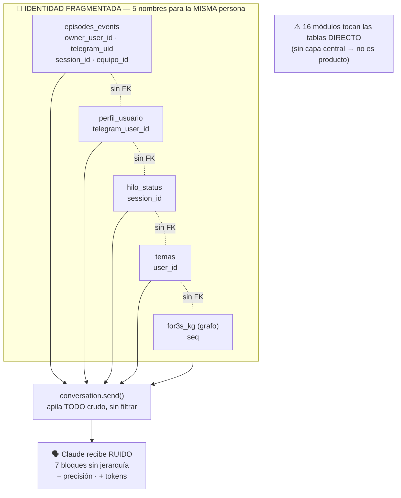
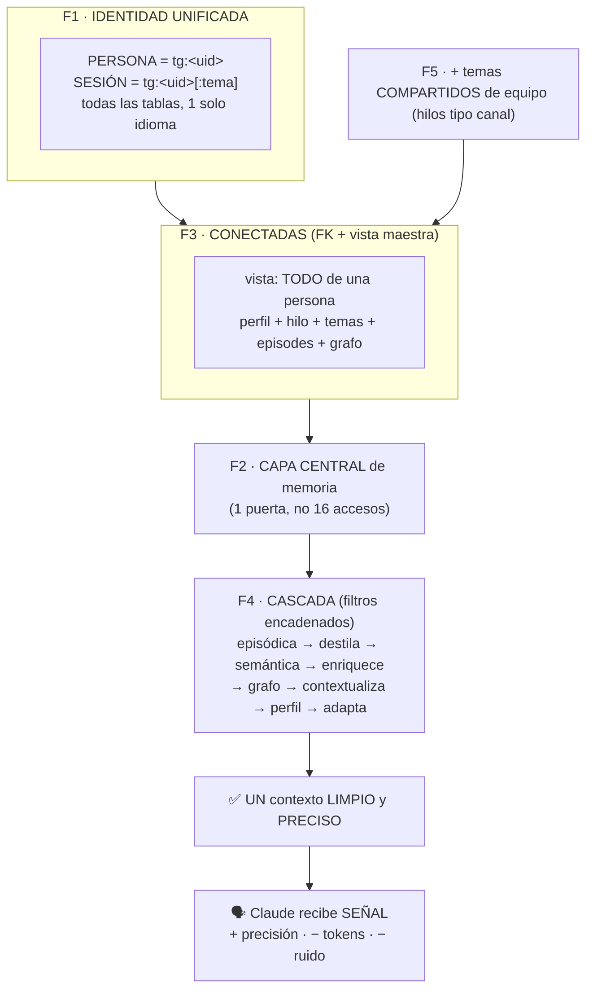

# 🧠 RONDA DE DISEÑO — Rediseño de la capa de memoria de For3s OS

**Fecha:** 2026-07-01
**Origen:** Brian — "existen tantos errores porque todo se hizo por separado; no es un sistema que
pueda estar como producto. Analiza todo y determinemos un plan con base en lo que tenemos."
**Naturaleza:** Ronda de diseño (arquitectura mayor). Este doc es el MAPA — NO se ha tocado código.
**Cubre:** MEM-1 (conectar), MEM-2 (temas de equipo), MEM-3 (cascada) + la raíz que los explica.

---

## 0. Diagramas — ANTES vs DESPUÉS

### 0.1 ANTES (hoy): 5 silos sueltos, volcados en paralelo

### 0.2 DESPUÉS (con el plan): un cerebro conectado y jerárquico

### 0.3 Resumen del cambio

| ANTES (hoy) | → | DESPUÉS (con el plan) | Fase |
|-------------|---|----------------------|------|
| 5 nombres de identidad | → | 1 (`tg:<uid>`) | F1 |
| 17 tablas silo sin FK | → | conectadas + vista maestra | F3 |
| 16 módulos tocan tablas directo | → | 1 capa central | F2 |
| 5-7 bloques en paralelo | → | cascada → 1 contexto | F4 ⭐ |
| temas solo privados | → | + temas de equipo | F5 |
| "no es producto" | → | sistema mantenible ✅ | — |

---

## 1. Análisis a profundidad — el estado REAL (verificado en BD + código, 2026-07-01)

For3s se construyó hito por hito (H5 memoria, H6 se-cuida, H8 equipo, AI2 temas, P1 perfil…). Cada
hito añadió sus tablas y su código de acceso SIN un diseño unificador. Resultado medido:

### 🔴 Problema 1 — FRAGMENTACIÓN DE IDENTIDAD (la raíz de todo)
La "persona" se identifica de **5 formas distintas** según la tabla:

| Tabla | Cómo identifica a la persona |
|-------|------------------------------|
| episodes_events | owner_user_id · equipo_id · telegram_user_id · session_id (4 formas en 1 tabla) |
| perfil_usuario | telegram_user_id |
| hilo_status | session_id |
| temas | user_id |
| equipo_miembros | user_id |
| corridas_equipo | telegram_user_id + session_id |
| sessions | id (= "tg:<uid>") |

→ 5 nombres para lo mismo: `telegram_user_id`, `user_id`, `owner_user_id`, `session_id`, `sessions.id`.
Para "saber todo de una persona" hay que hacer JOINs manuales entre columnas que ni se llaman igual.
NO existe un concepto único y canónico de PERSONA ni de SESIÓN que todas las tablas respeten.

### 🔴 Problema 2 — 17 de 25 tablas son SILOS sin Foreign Key
FKs existentes (solo 8, el "islote de sesiones"):
- sessions ← episodes_events, gh_resources, consulted_files, consulted_web
- gh_resources ← gh_files · corridas_equipo ← corrida_reportes · equipos ← equipo_miembros, solicitudes

Tablas SIN ninguna FK (17): **perfil_usuario, hilo_status, temas** (¡la memoria de la persona!),
corridas_equipo, audit, cron_corridas, dmn_*, governor_*, skills, owner, secrets, sessions, temas…
→ La memoria de una persona (perfil = quién es · hilo_status = en qué anda · temas = sus temas ·
episodes = lo que habló) está desperdigada en tablas que NO se conocen entre sí.

### 🔴 Problema 3 — RECUPERACIÓN EN PARALELO (MEM-3, la mejora mayor)
En `conversation.send()` el contexto se arma APILANDO bloques crudos en paralelo:
`contexto_final = contexto + línea_tiempo + últimos + recuerdos_semánticos + conceptos_grafo +
versión + repos…` — cada capa se concatena sin filtrar ni refinar. 14 funciones distintas recuperan
memoria. El LLM recibe 5-7 bloques sin jerarquía → ruido, menos precisión, más tokens. Brian: "es
atacar al cerebro por 5 frentes a la vez". Un cerebro real recupera en CASCADA (hipocampo→corteza):
cada capa refina la anterior hasta UN contexto limpio.

### 🔴 Problema 4 — SIN CAPA CENTRAL de memoria
~16 módulos acceden DIRECTO a las tablas (analytics, confidence, consolidator, conversation, dmn,
equipo, health, hilo_status, memory, microglia, perfil, relevance, tasks, telegram_channel, temas…).
No hay un "gestor de memoria" único. Cada hito enchufó su propio acceso → imposible cambiar el
esquema sin tocar 16 sitios.

### 🔴 Problema 5 — MEM-2: no existen temas COMPARTIDOS de equipo
Los temas son privados por persona (`tg:<A>:backend` ≠ `tg:<B>:backend`, no se ven). Falta un hilo
compartido tipo canal (Brian crea un tema, otro se suma al MISMO hilo). Hoy lo único común es el
CONOCIMIENTO (grafo), no un hilo de conversación.

### ✅ Lo que SÍ está bien (no tocar)
- `audit_events` separado a propósito (caja negra inmutable — no es memoria de razonamiento).
- `secrets` con su propio workspace de cifrado (KEK) — correcto y desacoplado.
- El aislamiento por persona funciona (BUG-14 cerrado) — el problema no es privacidad, es estructura.

---

## 2. El plan — 5 fases (de menor a mayor riesgo), basado en lo que tenemos

> Filosofía: NADA de big-bang. Cada fase es aditiva, verificable, y deja el bot funcionando. Se
> construye de una en una con OK de Brian. La raíz (identidad) primero; la cascada (lo vistoso) al
> final porque es lo más delicado.

### F1 · IDENTIDAD UNIFICADA — ✅ PASO 1 CONSTRUIDO 2026-07-01 (tabla personas)
> **HECHO:** migración `026_personas.sql` — creada la tabla `personas` (telegram_user_id PK +
> nombre + rol + fechas), el ANCLA canónica que faltaba (Hallazgo A de F3). Poblada desde
> equipo_miembros + owner + autores de episodes: Brian (encargado) + Sme G (miembro). Aditivo (solo
> añade tabla nueva, NO toca las existentes) → bot sano, verificado. La vista maestra ya ancla en
> personas (probado). En BD + repo (versionada) + contenedores. QUEDA de F1: declarar el estándar en
> el CÓDIGO (que módulos nuevos/tocados usen telegram_user_id) — se hace al construir F2/F3. La
> migración de datos (rellenar los 563 legado) es F3.

Definir UN concepto canónico de **persona** (el telegram user_id) y **sesión** (`tg:<uid>[:tema]`,
ya unificado tras el fix de BUG-17). Documentar el mapeo de las 5 formas actuales → la canónica.
Decidir el estándar: toda tabla nueva/tocada usa `telegram_user_id` como identidad de persona.
NO migra datos aún; fija la regla. Resuelve la raíz.

#### F1 — Análisis de CONEXIÓN entre hermanos (verificado con valores reales, 2026-07-01)

**Hallazgo clave:** existe UNA identidad natural — `user_id` (el telegram uid) — de la que TODO se
deriva. La conexión ya es posible, pero cada tabla la guarda con distinto nombre:

| Tabla | Columna de persona | ¿= al telegram uid? |
|-------|-------------------|---------------------|
| sessions | `id` = `tg:<uid>[:tema]` | sí (embebido como texto) |
| episodes_events | `session_id` + `telegram_user_id` + `owner_user_id` | sí (¡3 columnas!) |
| perfil_usuario | `telegram_user_id` | sí |
| temas | `user_id` | sí |
| hilo_status | `session_id` = `tg:<uid>[:tema]` | sí (embebido) |
| equipo_miembros | `user_id` | sí |

**3 roturas de conexión medidas:**
1. **episodes_events triplica la identidad EN VIVO.** En la MISMA sesión de Brian: 563 turnos con
   solo `owner_user_id`, 96 con `owner_user_id`+`telegram_user_id`, 4 con solo `telegram_user_id`.
   Caos histórico dentro de una tabla (cada hito llenó columnas distintas).
2. **5 nombres para el mismo número:** `user_id` · `telegram_user_id` · `owner_user_id` · el uid
   embebido en `session_id` · el embebido en `sessions.id`.
3. **`session_id` embebe el uid como STRING** (`tg:1923367928`) → cruzar sesión↔persona exige
   parsing de texto, no un JOIN limpio.

#### F1 — Decisión de diseño (propuesta)

- **PERSONA canónica = `telegram_user_id` (bigint).** Es la identidad natural, ya presente en todas
  las tablas (con distinto nombre). Toda tabla nueva/tocada usa ese nombre.
- **SESIÓN canónica = `tg:<uid>[:tema]`** (ya lograda en BUG-17). Deriva de la persona.
- **Regla de oro:** `session_id` SIEMPRE derivable de la persona (`'tg:'||telegram_user_id[||':'||tema]`)
  → no se inventa, se calcula. Una función única lo genera (elimina el parsing disperso).
- **episodes_events:** unificar las 3 columnas → `telegram_user_id` es la fuente de verdad de autor;
  `owner_user_id` pasa a ser solo el scope de privacidad (dueño del recuerdo, puede ser NULL=común);
  documentar qué significa cada una para que no se vuelvan a llenar al azar.
- **NO migrar datos en F1** — F1 fija la REGLA + documenta el mapeo. La migración de datos (rellenar
  telegram_user_id en los 563 legado) es parte de F3 (conectar), con backup.

Con F1 fijada, F2 (capa central) y F3 (FKs) tienen un cimiento: todas hablan `telegram_user_id`.

### F2 · CAPA DE ACCESO CENTRAL — ✅ CIMIENTO CONSTRUIDO 2026-07-01 (módulo memoria.py)
> **HECHO:** módulo nuevo `memoria.py` = FACHADA que coordina las 5 capas parciales (perfil, temas,
> hilo_status, memory, kg) tras la identidad canónica de F1, SIN reescribirlas (aditivo). Intriga con
> los hermanos reveló 2 estilos mezclados: clases por user_id (PerfilStore/TemaStore) vs funciones por
> session_id/pool (memory/hilo_status/kg) → la fachada TRADUCE. Construido y probado E2E:
> · `Memoria.persona(uid)` → junta perfil+temas+hilo+rol en 1 llamada (la vista maestra en código):
>   Brian (encargado, 2 hilos, perfil sí) · Sme G (miembro, 1 hilo, perfil no). ✅
> · `sesion_de(uid, tema)` → regla CANÓNICA de sesión (única, no se parsea a mano): tg:123 ·
>   tg:123:backend · general sin sufijo. ✅
> En repo + imagen (rebuild), bot sano. ⏳ QUEDA de F2: migrar los 16 consumidores a la fachada
> (GRADUAL, uno a la vez con su prueba — NO de golpe, sería arriesgado tocar 16 sitios) + añadir a la
> fachada el método `recordar()` que albergará la CASCADA de F4. El cimiento (módulo + persona +
> sesion_de) ya existe y probado.

#### F2 — Análisis de las capas HERMANAS actuales (verificado 2026-07-01)

**Hallazgo clave: F2 NO es crear una capa de cero — es UNIFICAR 5 capas parciales que ya existen,
cada una con su propia API, sueltas.**

| Capa parcial (ya existe) | Cubre | Quién la usa hoy |
|--------------------------|-------|------------------|
| `memory.py` (17 funciones) | conversación: episodes, sesiones, gh, consulted, last_repo, progreso | 5 módulos (aprende, dmn_tasks, hilo_status, subbloques, telegram_channel) |
| `perfil.py` (PerfilStore) | quién es la persona | perfil, conversation, telegram_channel |
| `temas.py` (TemaStore) | temas/hilos por persona | temas, conversation, telegram_channel |
| `kg.py` (12 funciones) | grafo: conceptos, repos, recursos | consolidator, conversation, kg |
| `hilo_status.py` (5 funciones) | estado del hilo (fase/next) | hilo_status, conversation, tasks |

**El problema medido:**
- `memory.py` (la más cercana a "capa central") solo la importan **5 de 16 módulos**. Los otros ~11
  van directo a las tablas o a las otras 4 capas parciales.
- Cubre solo memoria de CONVERSACIÓN — NO perfil, temas, grafo, hilo_status (esos tienen módulo
  aparte). → 5 fachadas distintas, el consumidor elige a cuál llamar (o va crudo a la tabla).
- Resultado: para "recuperar el contexto de una persona", conversation.py llama a 5 APIs distintas +
  las pega a mano (los 14 accesos que vimos en send()).

#### F2 — Decisión de diseño (propuesta)

- Crear una **FACHADA única `memoria`** (módulo nuevo o ampliar memory.py) que reexporte/oriente a las
  5 capas parciales, con una identidad canónica (F1) en todas sus firmas (`telegram_user_id`).
- **NO reescribir las 5 capas** (siguen siendo el motor) — la fachada las coordina. Aditivo.
- Métodos de alto nivel orientados a INTENCIÓN, no a tabla:
  · `memoria.persona(uid)` → perfil + temas + hilo actual (todo de la persona, 1 llamada)
  · `memoria.recordar(uid, tema, query)` → la CASCADA de F4 (episódica→semántica→grafo→perfil)
  · `memoria.guardar_turno(...)` → escribe episode + embebe + actualiza hilo, coordinado
- **Migración GRADUAL:** un consumidor a la vez pasa de "tabla directa / 5 APIs" a "la fachada".
  Cada paso verificado, sin big-bang. Cuando todos usen la fachada → cambiar el esquema = 1 sitio.
- F2 HABILITA F4: la cascada vive DENTRO de la fachada (`memoria.recordar`), no dispersa en send().

⚠️ F2 es refactor (toca muchos módulos) → gradual y con pruebas. Pero es lo que convierte la memoria
en un SISTEMA mantenible (producto) en vez de 5 fachadas + 11 accesos crudos.

### F3 · CONECTAR — ✅ CONSTRUIDO 2026-07-01 (migración 027: backfill + 4 FKs)
> **HECHO:** migración `027_conectar_memoria.sql` — la memoria quedó CONECTADA (MEM-1 resuelto).
> Análisis previo verificó que personas cubre TODOS los uid (0 huérfanos). Construido:
> · **Backfill:** los 563 turnos legado sin telegram_user_id (todos de Brian, owner+session lo
>   confirman) → rellenados. Ahora 0 turnos sin autor.
> · **4 FKs a personas:** perfil_usuario, temas, equipo_miembros, episodes_events → personas.
> ⚠️ **DECISIÓN CLAVE (análisis de comportamiento, evitó un bug):** las FKs son NULLABLE. episodes
> tiene flujos (CLI/worker/DMN) que guardan turnos SIN telegram_user_id → una FK NOT NULL los
> rompería. Una FK sobre columna nullable NO valida las filas NULL (Postgres estándar): valida los
> presentes, deja pasar los NULL. PROBADO E2E: (a) INSERT con telegram_user_id=NULL → PASA (flujos sin
> autor OK); (b) INSERT con uid inválido → RECHAZADO por la FK (integridad); (c) record_turn normal del
> bot → OK (seq 693). Integridad SIN romper flujos legítimos. En BD+repo+contenedores, bot sano.
> ⏳ QUEDA de F3: vista maestra `persona_completa` (ya prototipada + está en Memoria.persona de F2) +
> unificar nombres de columna (user_id vs telegram_user_id) — cosmético, la FK ya conecta por valor.

### F3 · (diseño original) CONECTAR (FKs + índice/vista maestra) 🟡
FKs entre las tablas de persona (perfil/hilo_status/temas → identidad). Una vista maestra
"todo de una persona" (perfil + hilo actual + temas + últimos episodios + sus conceptos del grafo).
Resuelve MEM-1. Requiere unificar primero los nombres de columna (F1).

#### F3 — Análisis de comportamiento (verificado 2026-07-01) — 3 hallazgos NUEVOS

**🔴 Hallazgo A — NO existe una tabla "personas/usuarios" canónica.** Los uid viven repartidos en
perfil_usuario (1 fila, incompleto), owner (solo el dueño), equipo_miembros (los del equipo),
episodes (autores). **No hay una tabla que liste TODAS las personas** → las FKs de MEM-1 NO tienen a
dónde apuntar. **F3 debe CREAR primero una tabla `personas`** (telegram_user_id PK + nombre + rol +
alta) poblada desde equipo_miembros/episodes; luego perfil/temas/hilo_status/episodes la referencian.
Esto NO estaba identificado antes — cambia el alcance de F3 (crear el ancla, no solo añadir FKs).

**🔴 Hallazgo B — COBERTURA DESIGUAL entre hermanos.** Los uid SÍ son coherentes (1923367928 Brian,
7740601619 Sme G en todas). PERO las tablas de persona NO cubren a todos por igual:
| persona | turnos | temas | perfil | hilos |
|---------|--------|-------|--------|-------|
| Brian (encargado) | 108 | 2 | ✅ | 2 |
| Sme G (miembro) | 26 | **0** | **❌** | 1 |
Sme G participa pero NO tiene perfil ni temas → la memoria de un miembro está incompleta (sistémico,
no un caso aislado; roza HA-2). La tabla `personas` (Hallazgo A) + poblar al entrar al equipo lo
cierra: todo miembro tendría su fila base.

**✅ Hallazgo C — la VISTA MAESTRA ya es viable HOY (probada en vivo).** Un JOIN que cruza por
user_id (derivando session_id) junta perfil+temas+turnos+hilos de una persona en 1 query — funcionó.
Es un "quick win" de F3: la vista se puede crear sin migrar datos (aunque el JOIN por parsing de
string mejora tras F1). Da de un vistazo "todo de una persona" (y hace evidente el hueco de Sme G).

#### F3 — Plan revisado (con los hallazgos)
1. **CREAR tabla `personas`** (telegram_user_id PK + nombre + rol + creada_at) — el ancla que faltaba.
2. **Poblarla** desde equipo_miembros + autores de episodes (backfill, con backup).
3. **Vista maestra** `persona_completa` (perfil+temas+hilo+turnos+conceptos) — quick win, ya probada.
4. **FKs graduales** perfil/temas/hilo_status/episodes.telegram_user_id → personas (tras unificar
   nombres en F1). Requiere que todo miembro tenga fila en personas (Hallazgo B).
5. Al entrar al equipo (puerta/invitar) → crear fila en personas (cierra la cobertura desigual).
⚠️ Migración de datos → backup + transacción atómica (como el fix de BUG-17).

### F4 · CASCADA — 🔵 PASO 1 CONSTRUIDO 2026-07-01 (cortacircuitos de query trivial)
> **Análisis del panorama completo (medido):** send() apila 10 bloques, cada uno con SU detector
> condicional (`_es_pregunta_*`). Corregí una suposición: el sistema NO vuelca todo crudo — los
> filtros por capa YA funcionan bastante (medido: "hola" → 5 recuerdos crudos pero bloque formateado
> = 0 chars, el filtro dist-min ya los descarta). El problema REAL medido: (1) DESPERDICIO — "hola"
> hace 2 búsquedas semánticas para nada; (2) FALSOS POSITIVOS residuales — "que opinas del clima" trae
> 858 chars de recuerdos irrelevantes (pasan el umbral 0.5 pero no aplican); (3) sin coordinación entre
> capas (cada detector dispara solo).
> **HECHO (paso 1, el de mayor impacto/menor riesgo):** CORTACIRCUITOS — `_es_query_trivial()` +
> saltar las 2 búsquedas semánticas si la query es trivial (saludo/agradecimiento/muy corta). La línea
> de tiempo reciente SÍ se inyecta igual. CONSERVADOR (ante duda, no-trivial → busca normal). Probado:
> 10/10 casos del detector + E2E en vivo ("hola"/"gracias" saltan; queries reales buscan). En
> repo+imagen, bot sano (F4 toca CADA turno → verificado con cuidado).
> **PASO 2 HECHO 2026-07-01 (umbral afinado):** bajado `_DIST_MAX_RECUERDO` de 0.75 → 0.55.
> 🔍 ANÁLISIS CON DATOS que corrigió el diseño (evitó romper casos buenos): medí la frontera de
> relevancia y descubrí que un UMBRAL FIJO NO SEPARA señal de ruido:
>   · relevantes reales a 0.15–0.37 · ruido genuino ("cumpleaños", "que hora es") a 0.42–0.47 →
>     zona de solape 0.37–0.42 irreducible con distancia sola.
>   · lo que creí "ruido" en "clima"/"pizza" ERA relevante real (sí se habló de eso) → un corte
>     agresivo los habría MUTILADO (0.40 deja clima/pizza en 1/5).
>   · "que hora es" (ruido) trae los mismos recuerdos cercanos que queries buenas → la distancia sola
>     no lo distingue.
> DECISIÓN (Brian): 0.55 = mejora real y segura (corta lo más lejano sin mutilar relevantes ≤0.37);
> NO forzar corte agresivo (contraproducente). Verificado + permanente.
> **PASO 3 HECHO 2026-07-01 (RE-RANKING) — F4 COMPLETO.** El paso que resuelve el ruido de frontera
> difusa que el umbral no podía. 🔍 ANÁLISIS: medí una 2ª señal — ¿el recuerdo comparte PALABRA CLAVE
> con la query? Resultado: relevantes comparten palabra (clima→"clima", pizza→"pizza", hora→"hora") o
> están muy cerca; el ruido genuino (clima→"como estas", cumpleaños→"como me llamo") NO comparte Y está
> lejano. REGLA (medida): dist < 0.40 → acepta siempre; dist ≥ 0.40 → solo si comparte palabra clave
> con la query. Implementado en `_formatear_recuerdos(recuerdos, query)` + `_palabras_clave()`.
> PROBADO E2E: cumpleaños (ruido) 629→**0 chars** (eliminado); clima 858→700 (cortó el ruido, mantuvo
> "clima para programar"); pizza/trabajo/hora INTACTOS (relevantes). Lo que el umbral fijo NO podía:
> cortar ruido SIN mutilar relevantes. Retrocompat (sin query → no aplica). Permanente, bot sano.
> ✅ **F4 COMPLETO: 3 pasos — cortacircuitos + umbral 0.55 + re-ranking por palabra clave.** La
> recuperación semántica ahora es notablemente más precisa (menos ruido, mismo recall de lo relevante).
>
> ✅ **LA CASCADA ESTRUCTURAL SE CONSTRUYÓ 2026-07-01 (M1-M4) — MEM-3 CERRADO, EN PRODUCCIÓN.** Lo que
> aquí quedó como "deuda fina" se completó como 4 sub-fases (M1-M4), de menor a mayor riesgo:
> · **M1** corte de relevancia global — el grafo trae los conceptos DEL TEMA de la query (helpers
>   `_palabras_clave_query_tema`/`_concepto_relevante`/`_formatear_conceptos_pq` en conversation.py);
>   si nada aplica → no inyecta. Panorama puro sigue trayendo todo (no filtrar por genéricas de panorama).
> · **M2** grafo navegable (**cierra MEM-1**) — `kg.episodios_de_concepto_con_sesion` (preserva
>   session_id, evita re-mezcla BUG-19) + `memory.turnos_por_seq` (aislado por sesión) +
>   `_enriquecer_con_episodios` → concepto→episodios REALES como evidencia. Enchufó las funciones
>   huérfanas del grafo. Probado E2E: otra sesión → 0 turnos (aislamiento).
> · **M3** cascada semántica→grafo — `_senal_de_recuerdos` extrae palabras de los 2 recuerdos más
>   relevantes (dist<0.4, sin genéricas, tope 12) → informan qué conceptos del grafo traer. Medido con
>   probes ("cli" 63→9, "issues" 57→16 conceptos). "una capa refina la siguiente".
> · **M4** ensamblaje único (**cierra MEM-3**) — `Memoria.recordar(session_id, query, scope, es_panorama)`
>   en memoria.py ensambla la cascada de memoria pura (semántica→grafo→episodios) en 1 punto; send() la
>   llama en 1 línea (antes ~40 dispersas). Enfoque de menor riesgo: solo memoria pura (los bloques
>   no-memoria —versión/repos/perfil/status/línea-de-tiempo— siguen en send()). Probado por EQUIVALENCIA
>   byte-a-byte con el código viejo (5/5) → refactor sin cambio de comportamiento.
> ✅ **DEUDA FINA CERRADA 2026-07-02 (commit 10f63a9):** `recordar()` ahora recibe `history` y absorbe
>   el BLOQUE DE MEMORIA INICIAL completo (línea-de-tiempo D-1 + retomar D-2 + semántica + grafo + episodios)
>   en un solo punto, en cascada. send() lo llama una vez. Verificado por EQUIVALENCIA byte-a-byte (5/5) →
>   cero cambio de comportamiento. hilo_status y perfil se quedan en send() A PROPÓSITO: su posición ENTRE
>   las capas no-memoria (versión/repos/arquitectura) importa para el orden del contexto que ve el LLM;
>   moverlos lo cambiaría (la curiosidad lo destapó). **MEM-3 cerrado del todo.**

### F4 · (diseño original) CASCADA ⭐🔴 (la mejora mayor, lo más delicado)
Reescribir la recuperación de `send()` como filtros ENCADENADOS en vez de 5 volcados:
episódica (ventana reciente) → destila lo relevante → semántica (enriquece con recuerdos afines) →
grafo (contextualiza con conceptos) → perfil (adapta a la persona) → **UN contexto limpio y preciso**.
Cada capa refina la anterior. Aquí encaja C3 del análisis previo (resolución determinista: binding
exacto antes de la semántica). Es la mejora de PRECISIÓN más grande. Delicado: toca el corazón del
contexto que ve el LLM → sesión dedicada, con pruebas E2E de calidad de respuesta.

#### F4 — Análisis CON PRUEBAS (medido en vivo 2026-07-01) — ¿es la cascada la mejor opción global?

**Mediciones reales sobre `tg:1923367928`:**
| query | dist de los 5 recuerdos | diagnóstico |
|-------|------------------------|-------------|
| "que hemos trabajado" | 0.27–0.33 | relevantes de verdad ✅ |
| **"hola"** | **0.0, 0.0, 0.0, 0.0, 0.0** | 🔴 un saludo trae 5 recuerdos (ruido puro) |
| **"cuando es mi cumpleaños"** | 0.37–0.48 | 🔴 5 recuerdos que NADA tienen de cumpleaños |
- Historial 619 chars + semántica 1454 chars (más que el historial) + grafo 63 conceptos + perfil +
  versión + repos → todo apilado por query.
- `buscar_semantico` SIEMPRE trae top_n=5, haya o no algo relevante (no hay corte de "nada aplica").

**Matiz IMPORTANTE que la prueba reveló (corrige el plan inicial):** el sistema NO está tan crudo
como asumimos. `_formatear_recuerdos` YA filtra parcialmente: corta dist>MAX y dist<MIN (query-a-sí-
misma), dedup, tope global de chars, tiered por relevancia. PERO: (a) cada capa filtra SOLA, aislada;
(b) no hay cascada donde el resultado de una refine a la siguiente; (c) `buscar_semantico` hace el
trabajo de traer 5 aunque luego se filtren (desperdicio); (d) no hay corte global "si nada supera
umbral, no inyectes esta capa".

**Veredicto (honesto, para producto global): la cascada SÍ es la mejor opción, PERO como EVOLUCIÓN,
no reescritura.** Reescribir de cero tiraría los filtros buenos que ya existen y es lo más arriesgado
(toca el contexto que ve el LLM). Diseño F4 revisado:
1. **Corte de relevancia global:** si ninguna capa supera su umbral, NO inyectar esa capa (el "hola"
   no debe traer recuerdos). Barato y gran ganancia.
2. **Encadenar, no reemplazar:** la ventana reciente (episódica) informa a la semántica (excluir lo
   ya presente — ya se hace parcial con excluir_ultimos); la semántica informa al grafo (traer solo
   conceptos de los recuerdos relevantes, no los 63); el perfil adapta el resultado final.
3. **C3 (resolución determinista):** si la query apunta a un tema/hilo/repo EXACTO, resolver por
   binding antes de la semántica (evita traer "lo parecido").
4. **Un solo punto de ensamblaje:** la cascada vive en `memoria.recordar()` (F2), no dispersa en
   send() (14 accesos). Un contexto final limpio.
5. **Verificación E2E de CALIDAD:** medir antes/después (chars inyectados por query + relevancia media
   + calidad de respuesta en un set de queries reales, incl. triviales como "hola"). Es la prueba de
   que mejora como producto, no solo "se ve más ordenado".
⚠️ Lo más delicado del plan: sesión dedicada, con el set de pruebas de calidad como red de seguridad.

### F5 · TEMAS DE EQUIPO — 🔵 CIMIENTO CONSTRUIDO 2026-07-01 (camino B, sesión compartida)
> **DECISIÓN (Brian): camino B** (el más seguro): un tema de equipo = UNA sesión compartida
> `eq:<equipo_id>:<tema>` a la que acceden todos los miembros (como un canal). NO toca el WHERE de
> buscar_semantico ni el scope de privacidad → cero riesgo de fuga (evita la contradicción del camino A).
> **HECHO:** migración `028_temas_equipo.sql` (tabla temas_equipo por equipo_id, FK a equipos+personas)
> + `TemaEquipoStore` en temas.py: `crear()` (registra la sesión en `sessions` — la FK del islote lo
> exige — + el tema), `listar()`, `existe()`, `sesion_tema_equipo(eid,nombre)` = 'eq:<eid>:<tema>'.
> PROBADO E2E: Brian y Sme G escriben en la MISMA sesión `eq:3:...` → ambos ven el hilo compartido
> (2/2 turnos, colaboración) + el aislamiento privado sigue intacto. Pruebas limpiadas (0 residuo).
> Permanente (BD+repo+imagen), bot sano.
> ⏳ QUEDA de F5 (UX, paso final): comando `/tema equipo <nombre>` (crear/entrar) + control de ACCESO
> en el canal (verificar que quien entra es del equipo, vía EquipoStore) + que `_sesion_de` use la
> sesión de equipo cuando el tema activo sea uno de equipo. El mecanismo (lo delicado) YA está probado;
> falta cablear la UX en telegram_channel. Aditivo/fail-closed: sin usar temas de equipo, todo igual.

### F5 · (histórico) DIFERIDA 2026-07-01 — la contradicción del camino A (por qué elegimos B):

> 🔴 **HALLAZGO MAYOR (medido, la razón de diferir):** al intentar construir F5 se destapó una
> CONTRADICCIÓN de diseño en el propio sistema, latente porque `equipo_id` JAMÁS se usó (0/698 turnos):
> · `buscar_semantico` filtra SIEMPRE por `session_id = $1` (filtro DURO en el WHERE base).
> · PERO el scope dice "la persona ve SU privada + la COMÚN del equipo" (`OR equipo_id IS NOT NULL`).
> · **Se contradicen:** si SIEMPRE filtras por UNA sesión, un turno común (que vive en otra sesión,
>   ej. `eq:<id>:<tema>`) NUNCA se alcanza. El mecanismo de "común trans-sesión" está ROTO de raíz.
> Probado E2E: un turno con equipo_id marcado NO se recupera ni siquiera sin scope (0 resultados) —
> confirmado que el `session_id=$1` lo bloquea.
> **Además:** la FK del islote de sesiones (F3) obliga a crear la sesión `eq:<id>:<tema>` en `sessions`
> antes de escribir turnos (buena integridad, pero F5 debe registrarla).
>
> ✅ **VERIFICADO SANO de paso:** el AISLAMIENTO privado funciona (SmeG NO ve lo privado de Brian).
> Las pruebas se hicieron en transacción con rollback → 0 residuo.
>
> **DECISIÓN (Brian): DIFERIR F5.** No urge (0 temas de equipo en uso). Arreglar la contradicción
> requiere repensar el WHERE de la recuperación (que lo común trascienda la sesión SIN romper el
> aislamiento privado = riesgo tipo BUG-14) + suite de aislamiento exhaustiva = sesión dedicada.
> **3 caminos de diseño para cuando se retome:**
>  (A) WHERE `(session_id=$1 OR equipo_id=<mi_equipo>)` — común trans-sesión, toca la recuperación +
>      privacidad (el más potente, el más delicado).
>  (B) tema de equipo = UNA sesión compartida `eq:<id>:<tema>` donde todos escriben/leen esa MISMA
>      sesión (sin cruzar sesiones ni depender de equipo_id) — más simple, no toca el WHERE, cambia
>      el modelo de "común". ⭐ probablemente el mejor punto de partida (menos riesgo).
>  (C) híbrido: sesión compartida (B) + equipo_id para búsqueda cruzada opcional.
> Cruza con H8 (equipo/puerta) y MULTI-INSTANCIA.

### F5 · (diseño original) TEMAS DE EQUIPO 🟡→🔴 (feature nueva — la más DELICADA: toca aislamiento/privacidad)
Hilos compartidos entre personas (además del privado por persona). Cruza con H8 (equipo) y
MULTI-INSTANCIA. Se diseña aparte cuando F1-F4 estén.

#### F5 — Análisis de los elementos que INTERACTÚAN (verificado 2026-07-01)

⚠️ **Por qué es la más delicada:** F5 toca el AISLAMIENTO entre personas (privacidad, que ya costó
BUG-14). Un tema compartido invierte la lógica: el scope que PROTEGE la privacidad es justo lo que
hay que ABRIR para colaborar. Cada elemento que interactúa mapeado:

| Elemento | Cómo funciona HOY | Qué toca F5 |
|----------|-------------------|-------------|
| `_sesion_de` | `tg:<uid>:<tema>` — lleva el uid → PRIVADO por diseño | tema compartido necesita clave SIN uid (ej. `eq:<equipo_id>:<tema>`) |
| `_scope_de` | miembro → `scope_user_id=su_uid` (se aísla) | en compartido, debe VER lo de otros del tema |
| filtro scope (memory) | `(owner_user_id=$X OR equipo_id IS NOT NULL)` | **YA soporta "común"** vía equipo_id |
| `record_turn(equipo_id)` | acepta el parámetro | **YA soporta marcar común** |
| `temas` (tabla) | `user_id` + `nombre` → privado por persona | necesita temas de equipo (sin user_id, con equipo_id) |

**🔴 Hallazgo CLAVE (medido): la memoria común de equipo está CONSTRUIDA PERO DESENCHUFADA.**
- 697 turnos, **TODOS con `equipo_id` NULL** → nunca se ha marcado un turno como común.
- `record_turn` acepta `equipo_id`, el filtro de scope lo contempla (`OR equipo_id IS NOT NULL`)...
- ...pero **`telegram_channel` NUNCA pasa `equipo_id`** (0 usos) → la capacidad existe a medias.
→ F5 NO inventa el mecanismo de "compartido": lo ENCHUFA (mismo patrón recurrente de For3s: capacidad
construida sin cablear).

#### F5 — Decisión de diseño (propuesta)
1. **Tema de equipo = nueva clave de sesión SIN uid:** `eq:<equipo_id>:<tema>` (vs privado
   `tg:<uid>:<tema>`). Todos los del equipo escriben/leen la MISMA sesión.
2. **Marcar sus turnos con `equipo_id`** (enchufar lo que ya existe): al guardar en un tema de equipo,
   `record_turn(equipo_id=<id>)` → el filtro de scope ya los hace visibles a todos los miembros.
3. **temas de equipo en la tabla** (opt-in): un tema con `equipo_id` en vez de `user_id` = compartido.
4. **UX:** `/tema equipo <nombre>` crea/entra a un tema compartido; el general y los privados siguen
   igual (aditivo, fail-closed: sin usar temas de equipo, todo sigue como hoy).
5. ⚠️ **PRUEBA DE AISLAMIENTO obligatoria (red de seguridad, como BUG-14):** verificar E2E que un tema
   compartido NO filtra la memoria PRIVADA de sus miembros (solo los turnos marcados equipo_id), y que
   alguien fuera del equipo NO ve el tema. Es lo más delicado — se prueba antes de dar por hecho.
⚠️ F5 se construye DESPUÉS de F1-F4 (necesita la identidad canónica y la capa central) y con la
suite de aislamiento como red. Cruza con H8 (equipo/puerta) y MULTI-INSTANCIA (tenant).

---

## 3. Orden recomendado y por qué

F1 (identidad) → F2 (capa central) → F3 (conectar) → F4 (cascada) → F5 (temas equipo).

La identidad es el cimiento: sin un concepto único de persona, conectar (F3) y la cascada (F4) se
construirían sobre arena. La capa central (F2) es lo que hace que el sistema sea mantenible como
PRODUCTO (cambiar memoria en 1 sitio, no 16). La cascada (F4) es lo que Brian más quiere pero es lo
más delicado → va cuando la base esté firme.

⚠️ **Es una Ronda grande.** Cada fase es su propio sub-proyecto (debatir→diseñar→construir→probar).
NO se toca código hasta que Brian apruebe fase por fase.

**Relacionado:** MEM-1/2/3 en PENDIENTES · análisis del código de referencia (C1 estado, C2
decisiones, C3 resolución determinista — encajan en F3/F4) · BUG-17 (ya unificó sesiones a tg:<uid>,
adelanta parte de F1) · H5/H6 (memoria actual) · H10-PLANEA (confianza, se beneficia de F4).