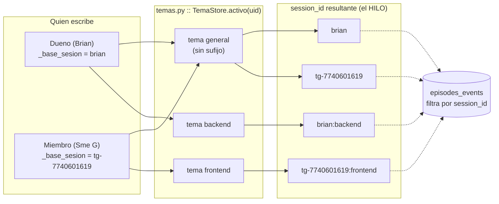
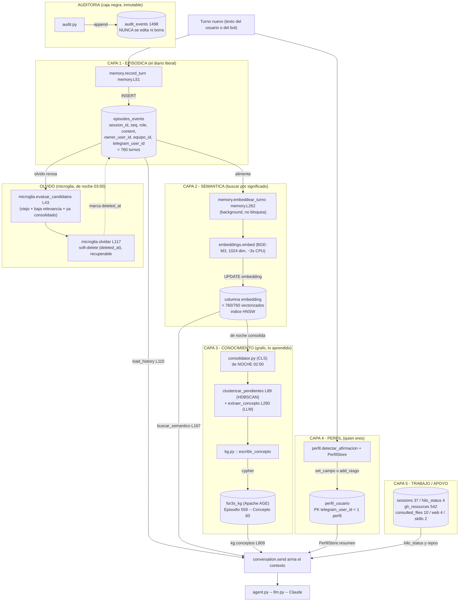
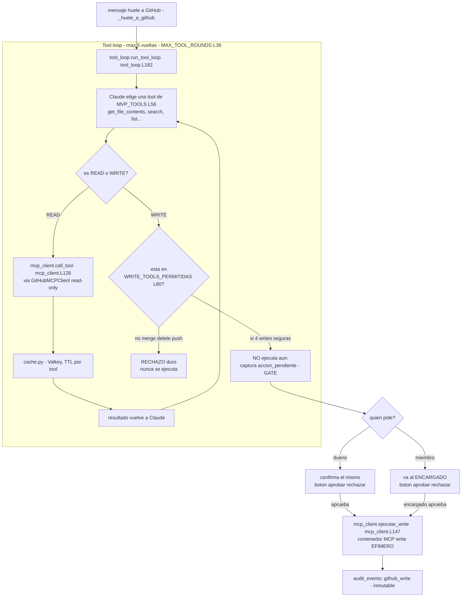
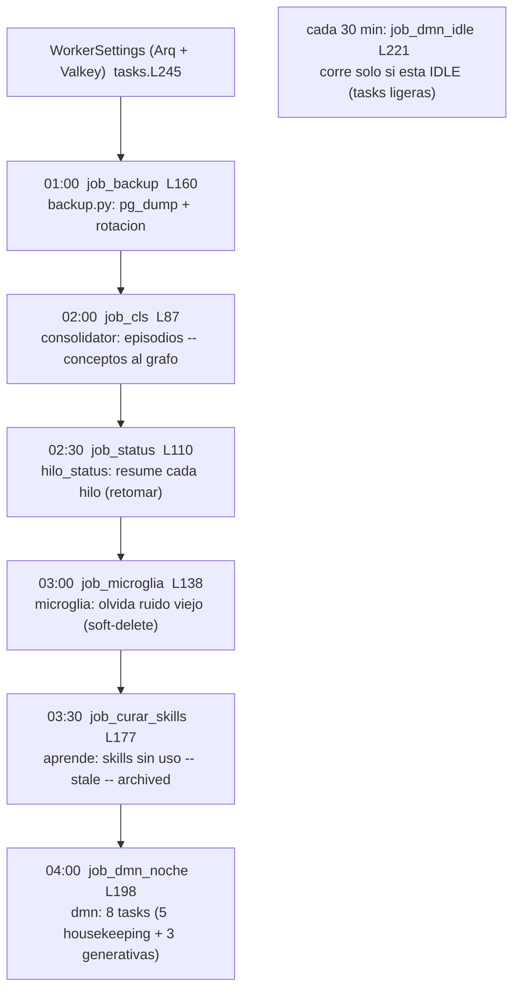
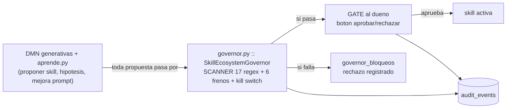
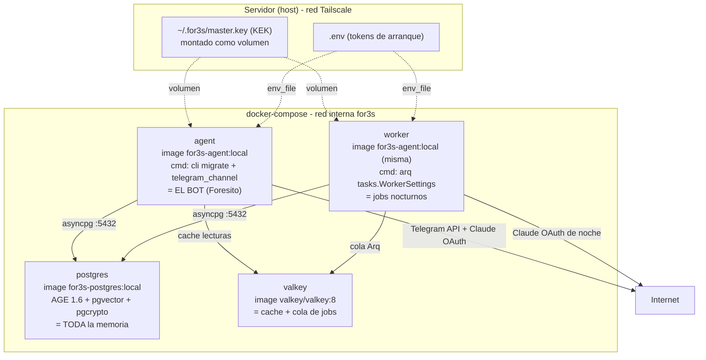
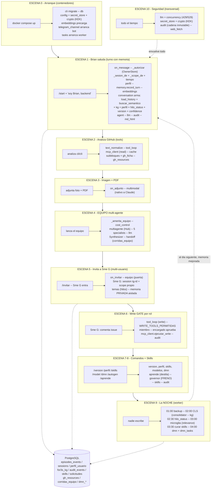
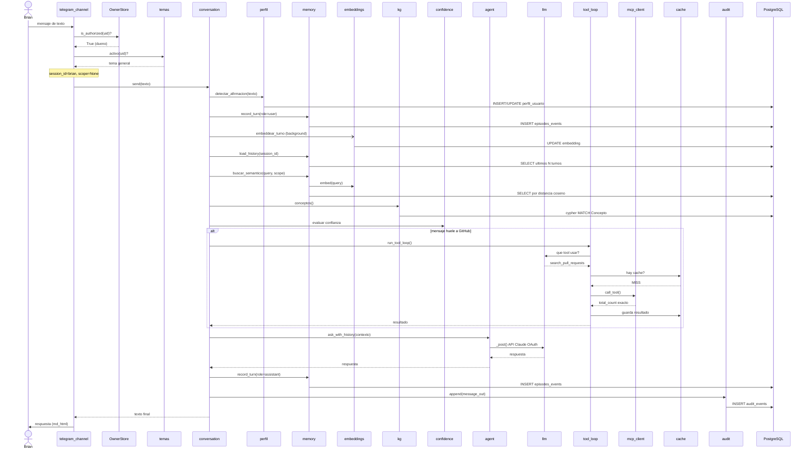

# User & Memory Flow — For3s OS (Foresito)

> **Qué es:** el flujo COMPLETO de un usuario en For3s, estilo onboarding-flow, pero
> en vez de frontend-web es **Telegram → Postgres**. Por cada paso: qué hace el USUARIO,
> qué VE como resultado, y QUÉ PASA POR DETRÁS — archivo por archivo, función por función,
> con los elementos de memoria que intervienen.
>
> Verificado leyendo el código real en el server (2026-06-28). Rutas:
> `packages/for3s-core/src/for3s_core/<archivo>.py`. [L###] = línea real.
> Equivalente a `godinez-studio/docs/onboarding-flow.md` pero para For3s.

---

## Full Funnel: mensaje del usuario → respuesta con memoria

```mermaid
flowchart TD
    %% ENTRADA (Telegram)
    subgraph ENTRADA["1 - Entrada (Telegram)"]
        U1["Usuario escribe en Telegram<br>ej: en que quedamos?"]
        U2["python-telegram-bot recibe el Update"]
        U3["telegram_channel.py<br>on_message  L2086"]
        U1 --> U2 --> U3
    end

    %% IDENTIDAD
    subgraph IDENT["2 - Identidad / Autorizacion (telegram_channel.py)"]
        I1["_autorizar(user)  L729"]
        I2{"OwnerStore.is_authorized(uid)  L339<br>lee ~/.for3s/telegram_owner.json"}
        I3["EquipoStore.autorizar (equipo.py)<br>consulta equipos / equipo_miembros"]
        I_OK["ok=True (dueno / miembro / puerta_abierta)"]
        I_NO["ok=False -- bot privado / puerta cerrada<br>CORTA, no procesa nada"]
        I1 --> I2
        I2 -->|es dueno| I_OK
        I2 -->|no es dueno| I3
        I3 -->|miembro o puerta| I_OK
        I3 -->|denegado| I_NO
    end

    %% SESION + SCOPE
    subgraph LLAVES["3 - Las 3 llaves de memoria (telegram_channel.py)"]
        K1["_sesion_de(user)  L704<br>= _base_sesion L696 + tema (temas.py)"]
        K1b["session_id: dueno = brian / miembro = tg-id (+ tema)"]
        K2["_scope_de(user)  L719<br>scope_user_id: dueno=None / miembro=id"]
        K3["telegram_user_id = user.id (el AUTOR, bug-3)"]
        K1 --> K1b
    end

    %% RUTA: 1 agente o EQUIPO
    subgraph RUTA["4 - Una agente o EQUIPO (telegram_channel.py)"]
        R1{"_amerita_equipo(texto)<br>17 frases 'analiza a fondo'..."}
        R2["EQUIPO: multiagente.py + specialists.py<br>5 en paralelo + handoff.py (audita)"]
        R3{"_sugiere_equipo(texto)<br>ofrece boton Lanzar"}
        R4["1 AGENTE (charla normal)"]
        R1 -->|si| R2
        R1 -->|no| R3
        R3 -->|senal suave| R4
        R3 -->|charla| R4
    end

    %% CONVERSACION: ESCRIBE memoria
    subgraph CONV["5 - Conversation.send() nucleo de memoria (conversation.py L682)"]
        direction TB
        E0["new Conversation(pool, agent, session_id,<br>telegram_user_id, scope_user_id)  L602"]
        E1["memory.ensure_session  memory.L38<br>INSERT INTO sessions"]
        E2["perfil.detectar_afirmacion (perfil.py)<br>PerfilStore -- perfil_usuario"]
        E3["ESCRIBE turno user:<br>memory.record_turn role=user  memory.L51<br>INSERT INTO episodes_events"]
        E4["background: memory.embeddear_turno  memory.L262<br>embeddings.embed BGE-M3 ~3s -- UPDATE embedding"]
        E0 --> E1 --> E2 --> E3 --> E4
    end

    %% CONTEXTO: LEE las memorias
    subgraph CTX["6 - Arma el contexto para Claude (conversation.py)"]
        direction TB
        X1["memory.load_history  memory.L110<br>memoria EPISODICA (turnos recientes)"]
        X2["memory.buscar_semantico (scope_user_id)  memory.L167<br>memoria SEMANTICA (embeddings, filtra scope)"]
        X3["kg.conceptos  conv.L809<br>CONOCIMIENTO (grafo for3s_kg, H6)"]
        X4["PerfilStore.resumen + hilo_status + version<br>PERFIL + estado del hilo + version"]
        X1 --> X2 --> X3 --> X4
    end

    %% MODELO
    subgraph LLM["7 - Modelo (agent.py -- llm.py)"]
        M1["Agent.ask_with_history  agent.L192"]
        M2["ClaudeProvider._post  llm.L108<br>API Claude (OAuth, sonnet-4-6)"]
        M3["respuesta del modelo"]
        M1 --> M2 --> M3
    end

    %% SALIDA
    subgraph OUT["8 - Guarda y responde"]
        S1["ESCRIBE turno assistant:<br>memory.record_turn role=assistant  memory.L51"]
        S2["background: embeber respuesta tambien"]
        S3["md_html.md_a_html_telegram (md_html.py)"]
        S4["_responder_seguro  L144<br>5 reintentos (red domestica)"]
        SMILE["Usuario recibe respuesta CON memoria"]
        S1 --> S2 --> S3 --> S4 --> SMILE
    end

    %% BASE DE DATOS
    subgraph DB["PostgreSQL (db.py pool)"]
        D1["episodes_events (760 turnos + embedding)"]
        D2["sessions 37 / perfil_usuario 1 / hilo_status 4"]
        D3["for3s_kg: Episodio 559 + Concepto 60"]
        D4["audit_events 1498 inmutable / skills 2"]
        D5["gh_resources 542 / consulted_files-web"]
    end

    %% CONEXIONES ENTRE ETAPAS
    U3 --> I1
    I_OK --> K1
    K1b --> R1
    K2 --> E0
    R4 --> E0
    R2 --> S1
    E4 --> X1
    X4 --> M1
    M3 --> S1
    E3 -.->|escribe| D1
    X1 -.->|lee| D1
    X2 -.->|lee| D1
    X3 -.->|lee| D3
    E2 -.->|escribe-lee| D2
    S1 -.->|escribe| D1
```



---

## HILOS — cómo se separan las conversaciones (temas.py + memory)

Un **hilo** = una conversación aislada. For3s separa los hilos por **persona × tema**, para
que dos personas (o dos temas distintos de la misma persona) NO se mezclen. La "llave" del
hilo es el `session_id`.



**Reglas de los hilos (verificadas en el código):**
- `temas.py :: TEMA_DEFAULT = "general"` [L24] → el tema general NO añade sufijo, así el
  dueño en general conserva su hilo histórico `brian` (no se rompe la memoria vieja).
- `TemaStore.activo(uid)` [L64] → consulta tabla `temas` qué tema tiene activo esa persona.
  Si falla, cae a `general` (fail-safe).
- `TemaStore.cambiar` [L80] → `/tema backend` desactiva el anterior y activa el nuevo (UPDATE+INSERT).
- `TemaStore.resumen_hilos` [L98] → `/hilos` lista cada hilo con su actividad real (último
  turno + nº de turnos), leyendo `episodes_events` por session_id.
- **Aislamiento:** cada `session_id` es una partición de `episodes_events`. `load_history` y
  `buscar_semantico` SIEMPRE filtran `WHERE session_id = $1` → un hilo nunca ve otro hilo.
- **Hoy hay 37 sessions** (hilos) en la BD de Foresito.

> ⚠️ El hilo (conversación) es PRIVADO por persona. Lo que SÍ se comparte en un equipo es el
> CONOCIMIENTO (el grafo `for3s_kg`), no el chat crudo. Ver sección "Memoria a detalle".

---

## MEMORIA A DETALLE — las 5 capas y cómo se comunican (flujo de datos)

For3s no tiene "una" memoria: tiene **5 capas** + 1 de auditoría. Este es el flujo de datos
REAL entre ellas (qué función escribe en cada una, qué función lee, y cómo se transforman los
datos de una capa a la siguiente).



### Cómo se comunican las capas (la cadena de transformación)

| Paso | De | A | Quién lo hace | Qué pasa con el dato |
|---|---|---|---|---|
| 1 | texto | EPISÓDICA | `record_turn` | el texto crudo se guarda como fila |
| 2 | EPISÓDICA | SEMÁNTICA | `embeddear_turno`→`embed` | el texto se convierte en vector de 1024 números |
| 3 | SEMÁNTICA | CONOCIMIENTO | CLS (noche) | clusters de turnos parecidos → un concepto en el grafo |
| 4 | texto | PERFIL | `detectar_afirmacion` | "soy backend" → campo rol en perfil_usuario |
| 5 | EPISÓDICA | OLVIDO | microglía (noche) | lo viejo+irrelevante+consolidado → deleted_at (recuperable) |
| L | TODAS | contexto | `conversation.send` | se juntan las 5 lecturas en el prompt de Claude |

### Las 3 llaves que controlan QUÉ memoria ve cada quien

| Llave | Controla | Dueño | Miembro |
|---|---|---|---|
| `session_id` | qué HILO (partición de episodes_events) | `brian` | `tg-<id>` |
| `scope_user_id` | filtro de la búsqueda SEMÁNTICA | `None` (ve todo) | `<id>` (solo suyo + común) |
| `equipo_id` | si un recuerdo es COMÚN del equipo | — | marca lo compartido |

> El filtro real de aislamiento (en `buscar_semantico` [memory L233]):
> `WHERE session_id=$1 AND (owner_user_id=scope OR equipo_id IS NOT NULL OR owner_user_id IS NULL)`
> → cada quien ve SU privada + la COMÚN del equipo + el legado del dueño. Nunca lo privado de otro.

---

## INTERACCIÓN DE TOOLS — GitHub, write gate, equipo

Cuando el mensaje "huele a GitHub" o requiere acción, For3s entra al **tool-loop**: el modelo
decide qué herramienta usar, se ejecuta, y el resultado vuelve al modelo. Las escrituras pasan
por un GATE de confirmación.



**Detalle de la interacción de tools:**
- `tool_loop.py :: run_tool_loop` [L182] — el bucle: Claude pide tool → se ejecuta → resultado
  vuelve → repite hasta que Claude termina o se llega a `MAX_TOOL_ROUNDS=5`.
- `MVP_TOOLS` [L56] — las herramientas de lectura permitidas (get_file_contents, search_issues,
  search_pull_requests para conteos exactos, list_*, etc.).
- `mcp_client.py :: GitHubMCPClient` [L137] — cliente MCP read-only SIEMPRE (subclase de
  `MCPClient` genérico [L68], que puede hablar con CUALQUIER servidor MCP — P4 fase 1).
- `cache.py` — las lecturas se cachean en Valkey (TTL por tool), degrada si Valkey cae.
- **GATE de escritura:** `WRITE_TOOLS_PERMITIDAS` [L80] = 4 writes reversibles (comentar, crear
  issue/PR/review). Cualquier otra (merge, delete, push) → rechazo duro. La write confirmada se
  ejecuta en un contenedor MCP **efímero** (`ejecutar_write` [L147]) → mínima superficie.
- **Por rol:** dueño confirma solo; miembro → la propone y el encargado aprueba (equipo.py + gate).

---

## COMPONENTES — todo lo que construimos (H5→H12) y dónde vive

For3s se construyó por hitos. Aquí cada componente, su archivo, qué hace y cómo se conecta al
flujo de memoria.

| Hito | Componente | Archivo(s) | Qué aporta | Se conecta a |
|---|---|---|---|---|
| H1-H4 | Chat + GitHub + multimodal | agent, llm, conversation, tool_loop, mcp_client, multimodal | el núcleo conversacional + manos | todo el flujo |
| **H5** | Memoria real (semántica + grafo) | memory, embeddings, kg | buscar por significado + grafo de conocimiento | capas 2 y 3 |
| **H6** | Se cuida (de noche) | consolidator (CLS), microglia, backup, relevance, tasks | consolida + olvida + respalda solo | capas 3 y olvido |
| **H7** | /model | modelos | elegir modelo (Haiku/Sonnet/Opus) | llm |
| **H8** | Equipo (multi-agente + multi-usuario) | multiagente, specialists, cost_control, equipo, temas, perfil, handoff, hilo_status | 5 agentes en paralelo + usuarios/hilos/perfil | ruta de equipo + hilos |
| **H9** | Sueña (DMN) | dmn, dmn_tasks | trabaja solo cuando esta idle (8 tasks) | capas 2/3 + generativas |
| **H10-PLANEA** | Metacognición | confidence | "se cuando no se" (mide confianza) | conversation.send |
| **H10-H12** | Aprende (skills) | skills, governor, aprende | crea/gobierna/cura sus propias skills | gate + audit |
| infra | Seguridad / datos | crypto, secret_store, audit, db, config | KEK, secrets cifrados, caja negra, conexion | toda la BD |
| infra | Utilidades | md_html, text_normalize, tiempo, web_fetch, subbloques, gh_ficha, concurrency, sandbox, cli, version | render, normalizar, zona horaria, fetch web, etc. | varios |

### El ciclo NOCTURNO — cómo la memoria se mantiene sola (tasks.py)



**Orden y por qué:** backup PRIMERO (red de seguridad antes de tocar nada) → CLS consolida →
status resume → microglía olvida (solo lo ya consolidado) → cura skills → DMN cierra la noche.
Todo verificado corriendo solo (no es demo).

### Componentes GENERATIVOS y su FRENO (H9 + H11)



- `governor.py` — el FRENO: escanea cada skill propuesta (17 anti-patrones, fail-closed),
  límites (≤3 nuevas/día, ≤100 activas), kill switch (auto-gen OFF por defecto).
- `aprende.py` — el MOTOR: `/aprende` destila skills de la conversación; auto-mejora en background.
- **Regla LOCKED:** nada generativo se activa sin pasar el governor + gate del dueño + audit.
  Por defecto la auto-generación está APAGADA (el dueño la enciende con `/autogen on`).

---

## Archivos que intervienen (nombre · descripción · interacción)

| # | Archivo | Qué hace | Con quién se comunica |
|---|---|---|---|
| 1 | **telegram_channel.py** | EL ORQUESTADOR. Recibe el mensaje, decide identidad/sesión/scope, bifurca a equipo o 1 agente, responde. | Importa: agent, conversation, memory, equipo, temas, perfil, multiagente, handoff, llm, db, audit. Es el punto de entrada de TODO. |
| 2 | **OwnerStore** (en telegram_channel.py [L320]) | Sabe quién es el DUEÑO. Lee `telegram_owner.json`. | Lo consulta `_autorizar` y `_base_sesion`/`_scope_de`. ⚠️ origen del bug owner→sesión vacía. |
| 3 | **equipo.py** | Multi-usuario: miembros, roles, la "puerta" (/invitar), autorización aditiva. | `telegram_channel._autorizar` lo llama si no eres dueño. Lee tablas `equipos`/`equipo_miembros`. |
| 4 | **temas.py** | Sub-hilos por tema dentro de una persona (/tema). | `_sesion_de` lo llama para añadir sufijo `:backend` al session_id. Tabla `temas`. |
| 5 | **conversation.py** | EL MOTOR DE CONVERSACIÓN. Arma el contexto (junta todas las memorias) y orquesta escribir/leer. | Llama a memory, perfil, kg, hilo_status, version, embeddings; usa Agent. |
| 6 | **memory.py** | LA MEMORIA. record_turn (escribe), load_history (lee reciente), buscar_semantico (lee por significado), embeddear_turno. | conversation.py la usa. Escribe/lee `episodes_events`, `sessions`. Llama embeddings. |
| 7 | **embeddings.py** | Convierte texto→vector (BGE-M3) para la memoria semántica. | memory.embeddear_turno y buscar_semantico la llaman. ~3s en CPU. |
| 8 | **kg.py** | El GRAFO de conocimiento (Apache AGE). Conceptos consolidados de noche (H6). | conversation.py lo consulta (conceptos). Esquema `for3s_kg`. |
| 9 | **perfil.py** | Quién es cada usuario (rol/stack/estilo). | conversation.py captura e inyecta. Tabla `perfil_usuario`. |
| 10 | **hilo_status.py** | Resumen "dónde quedamos" por hilo, para retomar. | conversation.py lo inyecta si pausa larga. Tabla `hilo_status`. |
| 11 | **agent.py** | Envuelve al modelo (ask / ask_with_history). | conversation.py lo usa; llama a llm.ClaudeProvider. |
| 12 | **llm.py** | Cliente de la API de Claude (OAuth, reintentos, rate-limit). | agent.py lo usa. Habla con la API externa. |
| 13 | **db.py** | El pool de conexión a Postgres (compartido por todos). | TODOS los de arriba lo usan para tocar la BD. |
| 14 | **audit.py** | Registro inmutable de seguridad (caja negra). | telegram_channel y otros escriben eventos. Tabla `audit_events`. |
| 15 | **md_html.py** | Convierte la respuesta Markdown → HTML de Telegram. | telegram_channel al responder. |

---

## Resumen de inputs del usuario (qué puede hacer)

| Acción del usuario | Cómo | Archivo que lo maneja | Efecto en memoria |
|---|---|---|---|
| Escribir un mensaje normal | texto en Telegram | on_message → Conversation.send | escribe 2 turnos (user+assistant) en episodes_events + embeddings |
| `/tema backend` | comando | temas.py | cambia el session_id (nuevo sub-hilo aislado) |
| `/perfil rol backend` | comando | perfil.py | escribe en perfil_usuario |
| `/invitar` | comando (dueño) | equipo.py | abre/cierra la puerta del equipo |
| "analiza a fondo X" | frase gatillo | multiagente.py + specialists.py | corre 5 agentes, audita en corridas_equipo |
| `/version` `/hilos` `/miembros` | comando | version.py / temas.py / equipo.py | solo lectura |
| pregunta "¿en qué quedamos?" | frase | conversation._es_pregunta_retomar | inyecta hilo_status + últimos turnos |

---

## Estados de error y recuperación

| Dónde | Error | Usuario ve | Recuperación |
|---|---|---|---|
| `_autorizar` | no es dueño/miembro | "⛔ Este bot es privado" | el dueño usa /invitar |
| `_autorizar` | puerta cerrada | "🔴 La puerta está cerrada" | el dueño abre con /invitar |
| OwnerStore | json no encontrado (cwd) | parece "perdió la memoria" 🐛 | **bug de la migración — ya parcheado** (montar /app/.for3s) |
| llm.py | rate-limit (429) | backoff silencioso / aviso | reintenta solo |
| llm.py | servidor saturado (529) | "🌩️ Anthropic saturado, reintenta" | reintenta solo |
| embeddings | modelo falla | (silencioso) degrada a sin-semántica | no rompe el turno |
| _responder_seguro | red doméstica parpadea | (silencioso) 5 reintentos | el bot no muere |

---

## Time-to-Response Breakdown (mensaje normal)

```
Usuario envía mensaje               0:00
├─ on_message + _autorizar          0:01   (lee owner json + tablas)
├─ _sesion_de / _scope_de           0:01   (3 llaves)
├─ record_turn (escribe user)       0:02   (INSERT episodes_events)
├─ load_history + buscar_semantico  0:03   (lee memorias; embed query ~ms)
├─ kg.conceptos + perfil + status   0:04   (inyecciones de contexto)
├─ Claude responde (OAuth)          0:08   (~4-6s sonnet-4-6)
├─ record_turn (escribe assistant)  0:09
├─ md→html + _responder_seguro      0:09
└─ Usuario recibe respuesta         0:10   ⭐
   (embedding del turno corre EN BACKGROUND ~3s después, no bloquea)
```

---

## Oportunidades de mejora (para PR4-A / PR6 / PR2)

### Alto impacto
1. **Owner robusto (PR6)** — la identidad del dueño no debe depender de un json en cwd; persistir en BD. Es la causa raíz del bug de la migración.
2. **Limpiar los 16 turnos huérfanos** en `tg:1923367928` (PR4-A) — basura del bug.
3. **Health del flujo (PR2)** — nada detecta automáticamente si el owner se desconfigura.

### Medio impacto
4. **Unificar la asimetría 'brian' vs 'tg:<id>'** — la sesión del dueño es un string fijo; documentar/blindar por qué y que no se rompa.
5. **Trazabilidad de autor (#3)** — confirmar que `telegram_user_id` se llena en TODOS los flujos (equipo incluido).

### Bajo impacto (pulido)
6. Indicador de "pensando..." más informativo durante análisis largos.
7. Mensaje de bienvenida en el primer contacto.

---

# PARTE C — AUDITORÍA TOTAL: contenedores + los 45 módulos (uno por uno)

> **Qué es:** el mapa COMPLETO de For3s OS, desde los contenedores hasta cada uno de los 45
> módulos de `for3s_core`. Por cada módulo: qué hace · de quién depende (USA) · quién lo usa
> (USADO_POR) · estado. Grafo de dependencias extraído automáticamente del código real
> (2026-06-28), no inventado. NO se omite ningún módulo.

## C.0 — Los CONTENEDORES (la infraestructura física)

For3s corre como **4 contenedores Docker** orquestados por `docker-compose.yml`. Así es como
se comunican entre ellos:



**Detalle de los contenedores (de `docker-compose.yml`):**

| Servicio | Imagen | Comando | Para qué | Depende de |
|---|---|---|---|---|
| **postgres** | `for3s-postgres:local` (build: Dockerfile.postgres) | entrypoint PG | TODA la memoria (AGE+pgvector+pgcrypto horneados) | — (healthcheck) |
| **valkey** | `valkey/valkey:8` | entrypoint | cache (db0) + cola de jobs Arq (db1) | — (healthcheck) |
| **agent** | `for3s-agent:local` (build: Dockerfile.agent, 9.63GB, BGE-M3 horneado) | `cli migrate && telegram_channel` | EL BOT — corre migraciones y arranca Telegram | postgres + valkey (healthy) |
| **worker** | `for3s-agent:local` (la MISMA imagen) | `arq tasks.WorkerSettings` | los jobs nocturnos (CLS, microglía, backup, DMN) | postgres + valkey (healthy) |

- **agent y worker = misma imagen, distinto comando** (uno es el bot, otro el cron).
- **Volúmenes clave:** `~/.for3s → /root/.for3s` Y `→ /app/.for3s` (el 2º se añadió en la
  migración para arreglar el bug del owner) + el volumen de datos de Postgres.
- **SIN DinD:** el agente NO lanza contenedores (idea "hermanos" de Brian). GitHub-MCP/render
  serán hermanos de red en v1.1.
- Otros Dockerfiles: `Dockerfile.workspace` (sandbox futuro), `docker/render/` (web_fetch JS),
  `docker/postgres/` (init de extensiones).

## C.1 — Mapa de dependencias de TODO el código (vista de capas)

Los 45 módulos se organizan en **capas** (los de abajo no dependen de los de arriba). Esto se
derivó del grafo real USA/USADO_POR:

```mermaid
flowchart TD
    subgraph L_ENTRY["CAPA ENTRADA (orquestadores, nadie los importa)"]
        TC["telegram_channel - usa 28 modulos"]
        CLI2["cli - terminal"]
        TASKS2["tasks - worker nocturno"]
        DMT["dmn_tasks - 8 tasks DMN"]
    end
    subgraph L_ORCH["CAPA ORQUESTACION"]
        CONV2["conversation - usa 16 modulos"]
        MULTI["multiagente"]
        SUBB["subbloques"]
        DMN2["dmn"]
    end
    subgraph L_DOMAIN["CAPA DOMINIO (memoria, equipo, skills, tools)"]
        MEM2["memory"] 
        KG2["kg"] 
        CONS["consolidator"] 
        MICRO["microglia"]
        EQ2["equipo"] 
        TEM2["temas"] 
        PERF2["perfil"] 
        HIL2["hilo_status"]
        SKL["skills"] 
        GOV2["governor"] 
        APR["aprende"]
        TL2["tool_loop"] 
        MCP2["mcp_client"] 
        SPEC["specialists"] 
        COST["cost_control"] 
        HOFF["handoff"]
        CONF2["confidence"] 
        MODS["modelos"]
    end
    subgraph L_BASE["CAPA BASE (infra, casi nadie depende de ellos)"]
        AGT2["agent"] 
        LLM2["llm"] 
        DB2["db"] 
        CFG2["config"] 
        AUD2["audit"]
        CRY["crypto"] 
        SEC["secret_store"] 
        EMB2["embeddings"] 
        CACHE2["cache"] 
        CONC["concurrency"]
        REL["relevance"] 
        BK["backup"] 
        SBX["sandbox"]
    end
    subgraph L_UTIL["CAPA UTILIDADES (puras, sin estado)"]
        MDH["md_html"] 
        TXT["text_normalize"] 
        TMP["tiempo"] 
        WEB["web_fetch"]
        GHF["gh_ficha"] 
        MM["multimodal"] 
        VER["version"]
    end

    L_ENTRY --> L_ORCH --> L_DOMAIN --> L_BASE
    L_DOMAIN --> L_UTIL
```



## C.2 — Los 45 módulos UNO POR UNO (tabla completa)

> **USA** = de quién depende · **USADO_POR** = quién lo importa. Verificado del código.
> 🟢 = vivo y conectado · 🟠 = vivo pero con pocas conexiones / revisar · ⚪ = HUÉRFANO (nadie lo importa).

| # | Módulo (L) | Qué hace | USA | USADO_POR | Estado |
|---|---|---|---|---|---|
| 1 | **agent** (244) | Arma el prompt y llama al LLM. En OAuth el system es solo la identidad de Claude Code. | llm | cli, conversation, telegram_channel | 🟢 |
| 2 | **aprende** (367) | MOTOR /aprende (H12): destila una skill de la conversación, pasa por el governor. | governor, memory, skills | dmn_tasks, tasks, telegram_channel | 🟢 |
| 3 | **audit** (105) | Audit chain inmutable (H2): cada decisión encadenada con SHA-256. | — | confidence, consolidator, conversation, microglia, secret_store, telegram_channel | 🟢 |
| 4 | **backup** (142) | Backup automático de la BD (H6), 3-2-1, rotación. | config | tasks | 🟢 |
| 5 | **cache** (109) | Cache de lecturas de GitHub en Valkey, TTL por tool. | — | conversation, dmn_tasks, tool_loop | 🟢 |
| 6 | **cli** (126) | Terminal con memoria persistente (H2) + subcomando `migrate`. | agent, config, conversation, db, llm | — (entrada) | 🟢 |
| 7 | **concurrency** (208) | Repartidor de carriles LLM (Token Bucket + circuit breaker) anti-429. | — | llm | 🟢 |
| 8 | **confidence** (276) | Metacognición (H10-PLANEA): "sé cuándo no sé", mide confianza. | audit | conversation | 🟢 |
| 9 | **config** (79) | Lee secrets de entorno/.env. Dual auth (OAuth/API key). | — | backup, cli, consolidator, dmn_tasks, hilo_status, multiagente, specialists, tasks, telegram_channel | 🟢 |
| 10 | **consolidator** (475) | CLS (Nodo 10): consolida episódico→conceptos del grafo, de noche. | audit, config, kg, llm, memory | dmn_tasks, tasks | 🟢 |
| 11 | **conversation** (1285) | El MOTOR de conversación: arma el contexto (todas las memorias) + orquesta turno. | agent, audit, cache, confidence, gh_ficha, hilo_status, kg, llm, mcp_client, memory, perfil, skills, subbloques, text_normalize, tool_loop, version | cli, multiagente, subbloques, telegram_channel | 🟢 |
| 12 | **cost_control** (124) | 7 capas de freno de costo del equipo multi-agente (H8). | — | multiagente | 🟢 |
| 13 | **crypto** (69) | KEK foundation (H4): jerarquía de cifrado de secretos. | — | secret_store | 🟢 |
| 14 | **db** (76) | Conexión async (asyncpg) + migraciones. La capa de datos. | — | cli, tasks, telegram_channel | 🟢 |
| 15 | **dmn** (404) | DMN "SUEÑA" (H9): trabaja solo cuando está idle. Motor. | — | dmn_tasks, telegram_channel | 🟢 |
| 16 | **dmn_tasks** (456) | Las 8 tasks del DMN (5 housekeeping + 3 generativas). | aprende, cache, config, consolidator, dmn, governor, llm, memory, tasks | — (entrada DMN) | 🟢 |
| 17 | **embeddings** (66) | Motor BGE-M3: texto→vector 1024 dim. La base de la memoria semántica. | — | memory, telegram_channel | 🟢 |
| 18 | **equipo** (482) | Multi-usuario (H8): miembros, roles, la puerta (/invitar). | — | telegram_channel | 🟢 |
| 19 | **gh_ficha** (144) | Ficha de un repo de GitHub (lenguajes %, contributors) vía REST. | — | conversation | 🟢 |
| 20 | **governor** (427) | GOVERNOR (H11): el FRENO. Scanner 17 regex + 6 frenos + kill switch. | skills | aprende, dmn_tasks, telegram_channel | 🟢 |
| 21 | **handoff** (100) | Audit trail del equipo multi-agente (AI3): cada corrida queda registrada. | — | telegram_channel | 🟢 |
| 22 | **hilo_status** (145) | STATUS por hilo (AI4): "en qué quedamos", regenerado de noche. | config, llm, memory | conversation, tasks | 🟢 |
| 23 | **kg** (210) | Knowledge Graph (H5, Nodo 1) sobre Apache AGE: repos/owners/conceptos. | — | consolidator, conversation, memory | 🟢 |
| 24 | **llm** (375) | La capa LLM (Nodo 3 PFC): ClaudeProvider dual OAuth/API + reintentos. | concurrency | agent, cli, consolidator, conversation, dmn_tasks, hilo_status, modelos, multiagente, specialists, subbloques, telegram_channel, tool_loop | 🟢 (el más usado) |
| 25 | **mcp_client** (190) | Cliente MCP: puente con GitHub MCP (read-only) + write efímero. Genérico (P4). | — | conversation, subbloques, telegram_channel, tool_loop | 🟢 |
| 26 | **md_html** (103) | Convierte Markdown de Claude → HTML de Telegram. | — | telegram_channel | 🟢 |
| 27 | **memory** (658) | Memoria episódica (H2, Nodo 2): record_turn, load_history, buscar_semantico. | embeddings, kg | aprende, consolidator, conversation, dmn_tasks, hilo_status, subbloques, telegram_channel | 🟢 (núcleo) |
| 28 | **microglia** (216) | Olvido inteligente (H6, Nodo 6): marca para olvido lo viejo+irrelevante. | audit | tasks | 🟢 |
| 29 | **modelos** (113) | Registro de modelos LLM seleccionables (/model, H7). | llm | telegram_channel | 🟢 |
| 30 | **multiagente** (405) | Red multi-agente (H8): Hub + message bus + Synthesizer. | config, conversation, cost_control, llm, specialists | telegram_channel | 🟢 |
| 31 | **multimodal** (211) | Lee adjuntos (imágenes, PDF, Word, Excel) para que For3s los "lea". | — | telegram_channel | 🟢 |
| 32 | **perfil** (178) | PERFIL de usuario (P1): quién es cada persona (rol/stack/estilo). | — | conversation, telegram_channel | 🟢 |
| 33 | **relevance** (116) | Cálculo de relevancia/decay para que la Microglía sepa qué olvidar. | — | — | ⚪ HUÉRFANO (revisar: ¿lo usa microglia inline?) |
| 34 | **sandbox** (105) | Sandbox de análisis (H4): lint del código de un PR en contenedor. | — | — | ⚪ HUÉRFANO (¿quedó sin cablear tras MCP?) |
| 35 | **secret_store** (67) | Almacén de secretos cifrados (H4): KEK + BD, plaintext efímero. | audit, crypto | telegram_channel | 🟢 |
| 36 | **skills** (178) | SKILLS (H10): receta reutilizable (SKILL.md) que el agente aplica. | — | aprende, conversation, governor, telegram_channel | 🟢 |
| 37 | **specialists** (297) | Catálogo de specialists del equipo (5 técnicos + 5 generales). | config, llm | multiagente | 🟢 |
| 38 | **subbloques** (658) | Orquestador de análisis por USO (Anexo R3) para repos grandes. | conversation, llm, mcp_client, memory | conversation, telegram_channel | 🟢 |
| 39 | **tasks** (290) | Scheduler de jobs nocturnos (Arq): CLS, status, microglía, backup, curar, DMN. | aprende, backup, config, consolidator, db, hilo_status, microglia, tiempo | dmn_tasks | 🟢 (= worker) |
| 40 | **telegram_channel** (2890) | EL ORQUESTADOR / la puerta de Telegram. Usa 28 módulos. | (28 módulos) | — (entrada) | 🟢 (el mayor) |
| 41 | **temas** (143) | TEMAS por persona (AI2): varios hilos por persona, uno activo. | — | telegram_channel | 🟢 |
| 42 | **text_normalize** (65) | Normaliza texto para los detectores (huele_a_github, etc.). | — | conversation, telegram_channel | 🟢 |
| 43 | **tiempo** (85) | Hora local del usuario (deduce zona del language_code). | — | tasks, telegram_channel | 🟢 |
| 44 | **tool_loop** (371) | Loop tool-use (GitHub MCP): el modelo decide qué tool usar. | cache, llm, mcp_client | conversation, telegram_channel | 🟢 |
| 45 | **version** (162) | version-self-awareness (AI5): el agente sabe su versión/hito/changelog. | — | conversation, telegram_channel | 🟢 |
| 46 | **web_fetch** (248) | Fetch de URLs no-GitHub (híbrido httpx + contenedor render JS). | — | telegram_channel | 🟢 |

> **Total: 46 módulos** (el conteo "45" era aproximado; el real es 46 sin contar `__init__.py`).

## C.3 — Hallazgos preliminares de la auditoría total

1. **2 HUÉRFANOS confirmados** (nadie los importa por nombre) — verificado a fondo 2026-06-28:
   - **`relevance.py`** ⚠️ — la columna `relevance` SÍ se usa (microglia.py la lee en su SQL
     para decidir qué olvidar), PERO el MÓDULO `relevance.py` (que calcula/actualiza esa columna
     con la fórmula de decay v2) **no lo importa nadie**. → o la fórmula se aplica en otro lado
     (ej. un job), o la columna se quedó estática. **Verificar en PR4-A**: ¿quién actualiza
     `relevance`? Si nadie, el decay no está corriendo (bug silencioso de H6).
   - **`sandbox.py`** 🔴 — CÓDIGO MUERTO confirmado. Las únicas menciones son COMENTARIOS
     (governor: "requiere sandbox de skills que aún no existe"; telegram_channel: un comentario).
     Nadie ejecuta `sandbox.py`. Era el lint de PR en contenedor (H4) que quedó sin cablear tras
     migrar a GitHub MCP. → candidato a borrar o re-cablear (PR1/PR4-A).
2. **telegram_channel.py (2890 L) usa 28 módulos** — es el cuello de botella de complejidad
   (todo pasa por ahí). Candidato #1 a refactor en PR1/PR9 (claridad/UX producto).
3. **conversation.py (1285 L) usa 16 módulos** — el 2º más acoplado. Es el motor real.
4. **llm.py es el más reutilizado** (12 módulos lo importan) — núcleo crítico, cualquier cambio
   ahí afecta a todo. Tratar con cuidado.
5. **Las capas están bien ordenadas** (las utilidades no dependen del dominio) → arquitectura
   sana en general; los huérfanos son la excepción a limpiar.

> Esta Parte C es el insumo directo de **PR1** (claridad: qué se conecta a qué) y **PR7**
> (revisar cada H). Los huérfanos detectados alimentan **PR4-A** (código muerto a limpiar).

---

> **Documento completo:** Parte B (flujo memoria/usuario) + hilos + memoria a detalle +
> tools + componentes + **Parte C (auditoría total de los 46 módulos + contenedores)**.
> Verificado contra el código real del server el 2026-06-28.

---

# CASO DE USO END-TO-END — "Un día con Foresito" (ejercita CADA elemento)

> **Qué es:** una historia completa que dispara, paso a paso, TODOS los elementos de For3s OS.
> Por cada acción: lo que hace el usuario · lo que ve · y EXACTAMENTE qué módulo/función/tabla
> actúa por detrás (verificado contra el código real). No se omite ningún subsistema.
> Sirve como guion de prueba: si quieres probar For3s entero, sigue estos pasos en orden.

**Personajes:** Brian (dueño) y Sme G (miembro). **Objetivo:** ver los 46 módulos en acción.

---

## DIAGRAMA GENERAL — las 11 escenas y sus módulos



## DIAGRAMA DE SECUENCIA — un turno REAL paso a paso (Escena 1+2 a detalle)

Esto es lo que pasa, en ORDEN temporal exacto, cuando Brian manda un mensaje que toca memoria
y GitHub. Cada flecha es una llamada real entre módulos.



---

## ESCENA 0 — Arranque del sistema (contenedores)

**Qué pasa:** se levantan los 4 contenedores con `docker compose up`.

| # | Qué ocurre | Módulo / archivo | Tabla / efecto |
|---|---|---|---|
| 0.1 | `postgres` arranca, healthcheck OK | Dockerfile.postgres (AGE+pgvector+pgcrypto) | la BD con toda la memoria |
| 0.2 | `valkey` arranca, healthcheck OK | valkey/valkey:8 | cache (db0) + cola jobs (db1) |
| 0.3 | `agent` corre `cli migrate` | **cli** → **db** | aplica migraciones pendientes (schema_version) |
| 0.4 | `agent` arranca el bot | **telegram_channel** main [L2828] | registra 18 comandos + handlers; crea OwnerStore desde `/app/.for3s/telegram_owner.json` |
| 0.5 | Carga config + secrets | **config**, **secret_store** (KEK via **crypto**) | descifra el token de Telegram y el de Claude |
| 0.6 | Precarga modelo de embeddings | **embeddings** (BGE-M3, ~160s) | listo para vectorizar |
| 0.7 | `worker` arranca Arq | **tasks** WorkerSettings [L245] | registra los 7 crons nocturnos |

✅ **Elementos ejercitados:** cli, db, config, secret_store, crypto, embeddings, telegram_channel, tasks + los 4 contenedores.

---

## ESCENA 1 — Brian saluda (primer turno con memoria)

**Usuario:** Brian escribe `/start`, luego `"hola, soy Brian, trabajo en backend con Python"`.

| # | Qué ocurre | Módulo / función | Tabla / efecto |
|---|---|---|---|
| 1.1 | `/start` → bienvenida + menú por rol | telegram_channel.on_start [L605], _publicar_menu [L755] | set_my_commands (menú admin) |
| 1.2 | Llega el texto → autoriza | **on_message** [L2086] → **_autorizar** [L729] → OwnerStore.is_authorized [L339] | reconoce a Brian = dueño |
| 1.3 | Calcula las 3 llaves | _sesion_de [L704] (→**temas**.activo), _scope_de [L719] | session_id="brian", scope=None, uid |
| 1.4 | Hora local del usuario | **tiempo**.contexto_temporal | inyecta hora CDMX (no la del server UTC) |
| 1.5 | Crea el motor | **conversation**.Conversation [L602] → send [L682] | — |
| 1.6 | Detecta "soy Brian... backend" | **perfil**.detectar_afirmacion → PerfilStore | INSERT perfil_usuario (rol=backend, stack=Python) |
| 1.7 | Asegura sesión + ESCRIBE turno | **memory**.ensure_session [L38] + record_turn [L51] | INSERT sessions + INSERT episodes_events (role=user) |
| 1.8 | Vectoriza en background | **memory**.embeddear_turno [L262] → **embeddings**.embed | UPDATE embedding (~3s, no bloquea) |
| 1.9 | Arma contexto | load_history [L110] + buscar_semantico [L167] + **kg**.conceptos + PerfilStore.resumen + **hilo_status** + **version** | junta todas las memorias |
| 1.10 | Mide su confianza | **confidence** (H10-PLANEA) evaluar_respuesta | si dudara, lo diría; aquí responde normal |
| 1.11 | Llama al modelo | **agent**.ask_with_history [L192] → **llm**.ClaudeProvider._post (vía **concurrency**) | API Claude OAuth |
| 1.12 | ESCRIBE respuesta + responde | memory.record_turn (role=assistant) → **md_html** → _responder_seguro [L144] | INSERT episodes_events + mensaje en Telegram |
| 1.13 | Audita | **audit**.append | INSERT audit_events (message_in/out) |

✅ **Ejercitados:** telegram_channel, conversation, memory, embeddings, kg, perfil, hilo_status, version, confidence, agent, llm, concurrency, md_html, audit, tiempo, temas.

---

## ESCENA 2 — Brian analiza un repo de GitHub (tools / MCP)

**Usuario:** `"analiza el repo github.com/cli/cli, ¿cuántos PRs cerrados tiene?"`

| # | Qué ocurre | Módulo / función | Efecto |
|---|---|---|---|
| 2.1 | Limpia tracking de URL | **text_normalize**.limpiar_urls | URL limpia |
| 2.2 | Detecta que huele a GitHub | conversation._huele_a_github | activa el tool-loop |
| 2.3 | Entra al loop de tools | **tool_loop**.run_tool_loop [L182] (máx 5 vueltas) | — |
| 2.4 | Claude elige `search_pull_requests` (conteo exacto) | de **MVP_TOOLS** [L56] | — |
| 2.5 | Ejecuta la tool (read-only) | **mcp_client**.call_tool [L126] (GitHubMCPClient) | total_count exacto en 1 llamada |
| 2.6 | Cachea la lectura | **cache** (Valkey, TTL por tool) | 2ª lectura sería HIT 0.000s |
| 2.7 | (si fuera repo grande) trocea por uso | **subbloques** (Anexo R3) | lee por categorías sin colgarse |
| 2.8 | Ficha del repo si la pide | **gh_ficha** (REST: lenguajes %, contributors) | — |
| 2.9 | Guarda el repo visto | memory.save_gh_tool_calls → gh_resources | INSERT gh_resources |
| 2.10 | Responde con el número real | (como Escena 1.11-1.13) | "4206 PRs cerrados" |

✅ **Ejercitados:** text_normalize, tool_loop, mcp_client, cache, subbloques, gh_ficha, memory(gh_resources).

---

## ESCENA 3 — Brian manda una imagen y un PDF (multimodal)

**Usuario:** envía una foto + un PDF con la pregunta `"¿qué dice este documento?"`

| # | Qué ocurre | Módulo / función | Efecto |
|---|---|---|---|
| 3.1 | Llega adjunto (PHOTO o Document) | telegram_channel.on_adjunto [handler L2867] | — |
| 3.2 | Procesa el archivo | **multimodal** (imagen/PDF nativo a Claude; Word/Excel→texto) | base64 a la API |
| 3.3 | Conversa con el adjunto | conversation.send(adjuntos=...) | Claude "ve" la imagen / "lee" el PDF |
| 3.4 | NO guarda el base64 en memoria | (solo una nota del adjunto) | episodes_events sin el binario |

✅ **Ejercitados:** multimodal, on_adjunto.

---

## ESCENA 4 — Brian pide un análisis profundo (EQUIPO multi-agente)

**Usuario:** `"lanza el equipo y haz una auditoría completa de este PR"`

| # | Qué ocurre | Módulo / función | Efecto |
|---|---|---|---|
| 4.1 | Detecta gatillo directo | telegram_channel._amerita_equipo (17 frases) | dispara el equipo |
| 4.2 | Semáforo global anti-429 | _equipo_lock (G robustez) | solo 1 corrida a la vez |
| 4.3 | Cost-control 7 capas | **cost_control** | tope de gasto, no runaway |
| 4.4 | Lanza el Hub + N specialists | **multiagente** (Hub+bus+Synthesizer) | 5 en paralelo |
| 4.5 | Cada specialist trabaja | **specialists** (code/security/test/perf/doc) → cada uno **llm** | análisis paralelo |
| 4.6 | Synthesizer combina | multiagente.Synthesizer | informe unificado |
| 4.7 | Audita la corrida | **handoff**.registrar_corrida | INSERT corridas_equipo + corrida_reportes (texto de cada uno) |
| 4.8 | Guarda informe en el hilo de Brian | memory.record_turn (autor=brian) | episodes_events |

✅ **Ejercitados:** multiagente, specialists, cost_control, handoff, concurrency.

---

## ESCENA 5 — Brian invita a Sme G (multi-usuario / la puerta / hilos)

**Usuario:** Brian escribe `/invitar` (abre la puerta). Sme G escribe al bot por primera vez.

| # | Qué ocurre | Módulo / función | Efecto |
|---|---|---|---|
| 5.1 | Brian abre la puerta | telegram_channel.on_invitar [L1566] → **equipo** | UPDATE equipos (puerta abierta) |
| 5.2 | Sme G escribe → autoriza | _autorizar [L729] → equipo.autorizar → motivo "puerta_abierta" | la registra como miembro |
| 5.3 | Bienvenida + aviso al encargado | _bienvenida_y_aviso | mensaje a Sme G + aviso a Brian |
| 5.4 | Sus 3 llaves son distintas | _sesion_de → "tg:<smeg_id>", _scope_de → smeg_id | hilo y scope propios |
| 5.5 | Sme G crea un tema | on_tema [L1727] → **temas** | session_id "tg:<id>:frontend" |
| 5.6 | Escribe; su memoria es PRIVADA | memory.record_turn(owner_user_id=smeg_id) | episodes_events aislado |
| 5.7 | buscar_semantico la aísla | filtro scope (owner_user_id=smeg OR equipo_id OR NULL) | NUNCA ve lo privado de Brian |
| 5.8 | Brian ve `/miembros` y `/hilos` | on_miembros [L1952], on_hilos [L1992] → equipo/temas | lista quién está + actividad |

✅ **Ejercitados:** equipo, temas (hilos), aislamiento de memoria (scope_user_id), on_invitar/miembros/hilos.

---

## ESCENA 6 — Sme G propone un cambio en GitHub (write GATE por rol)

**Usuario:** Sme G pide `"comenta en el issue #42 que ya está resuelto"`.

| # | Qué ocurre | Módulo / función | Efecto |
|---|---|---|---|
| 6.1 | Claude propone `add_issue_comment` | tool_loop → es WRITE | NO ejecuta aún |
| 6.2 | ¿Está permitida? | **WRITE_TOOLS_PERMITIDAS** [L80] | sí (es de las 4 seguras) |
| 6.3 | Sme G es MIEMBRO → va al encargado | _proponer_write_miembro | crea solicitud (tabla solicitudes) + avisa a Brian [✅/❌] |
| 6.4 | Brian aprueba | on_gate_select | — |
| 6.5 | Ejecuta la write REAL | **mcp_client**.ejecutar_write [L147] (contenedor MCP efímero) | comenta en GitHub |
| 6.6 | Audita la escritura | audit.append (github_write) | INSERT audit_events |
| 6.7 | Avisa a Sme G del resultado | telegram_channel | mensaje |

✅ **Ejercitados:** tool_loop (write), mcp_client.ejecutar_write, equipo (gate por rol), audit, tabla solicitudes.

---

## ESCENA 7 — Comandos de autoservicio

**Usuario:** Brian prueba los comandos.

| Comando | Handler | Módulo | Qué muestra |
|---|---|---|---|
| `/version` | on_version [L1469] | **version** | versión + hito + changelog |
| `/perfil rol backend` | on_perfil [L1233] | **perfil** | ver/editar su perfil |
| `/skills` | on_skills [L1194] | **skills** | sus skills aprendidas |
| `/model` | on_model [L1504] | **modelos** | elegir Haiku/Sonnet/Opus |
| `/cupo` `/estado` `/diagnostico` | on_cupo/estado/diagnostico | telegram_channel | salud básica |
| `/dmn` | on_dmn [L1370] | **dmn** | estado del "sueño" + propuestas |
| `/autogen on` | on_autogen [L1317] | **governor** | enciende auto-generación (kill switch) |
| `/aprende` | on_aprende | **aprende** | destila una skill de la conversación |

✅ **Ejercitados:** version, perfil, skills, modelos, dmn, governor, aprende.

---

## ESCENA 8 — Brian enseña una skill (H10-H12 APRENDE + GOVERNOR)

**Usuario:** `/aprende` tras una conversación útil.

| # | Qué ocurre | Módulo / función | Efecto |
|---|---|---|---|
| 8.1 | Destila la skill de la conversación | **aprende**.aprender_de_conversacion | genera SKILL.md (LLM) |
| 8.2 | PASA POR EL FRENO | **governor** (scanner 17 regex + 6 frenos) | si falla → governor_bloqueos |
| 8.3 | Si pasa → la guarda | **skills**.SkillStore | INSERT skills |
| 8.4 | Audita | audit.append | INSERT audit_events |
| 8.5 | (auto-mejora) en background tras una corrida | aprende.proponer_skill_auto → governor → GATE a Brian | propuesta con [✅/❌] |

✅ **Ejercitados:** aprende, governor, skills, audit.

---

## ESCENA 9 — La NOCHE: For3s se cuida y sueña solo (worker)

**Nadie escribe.** El `worker` corre los crons (tasks.py). Brian ve todo al día siguiente.

| Hora (Mx) | Job | Módulo | Qué hace |
|---|---|---|---|
| 01:00 | job_backup [L160] | **backup** | pg_dump + rotación (red de seguridad PRIMERO) |
| 02:00 | job_cls [L87] | **consolidator** (CLS) | clusteriza episodios → escribe **conceptos** al grafo (**kg**) |
| 02:30 | job_status [L110] | **hilo_status** | resume "en qué quedamos" de cada hilo |
| 03:00 | job_microglia [L138] | **microglia** | marca para olvido lo viejo+irrelevante+consolidado (usa **relevance**) — soft-delete recuperable |
| 03:30 | job_curar_skills [L177] | **aprende** | skills sin uso → stale → archived |
| 04:00 | job_dmn_noche [L198] | **dmn** + **dmn_tasks** | 8 tasks (5 housekeeping reales + 3 generativas gobernadas) |
| cada 30m | job_dmn_idle [L221] | **dmn** | corre tasks ligeras SOLO si está idle (**minutos_idle**) |

✅ **Ejercitados:** tasks (worker), backup, consolidator, kg, hilo_status, microglia, relevance, aprende(curar), dmn, dmn_tasks.

> ⚠️ Aquí es donde se VERIFICA el hallazgo de la Parte C: ¿el job de microglía lee una columna
> `relevance` que de verdad se actualiza? Si `relevance.py` no se llama en ningún job, el decay
> no corre → bug silencioso (a confirmar en PR4-A).

---

## ESCENA 10 — Seguridad y robustez (transversal, todo el tiempo)

| Situación | Módulo | Qué pasa |
|---|---|---|
| Anthropic satura (529) | **llm** + telegram_channel | backoff + "🌩️ saturado, reintenta" (no muere) |
| Rate-limit (429) | **llm** + **concurrency** | distingue real vs falso-system, reintenta o avisa |
| Red doméstica parpadea | _responder_seguro [L144] | 5 reintentos, el bot no cae |
| Cada secreto que se usa | **secret_store** + **crypto** (KEK) | plaintext solo el instante de uso |
| Toda decisión sensible | **audit** | cadena inmutable SHA-256 (caja negra) |
| Una URL no-GitHub | **web_fetch** | httpx + contenedor render JS si es SPA |

✅ **Ejercitados:** llm, concurrency, secret_store, crypto, audit, web_fetch.

---

## RESUMEN — cobertura de los 46 módulos por el caso de uso

| Escena | Módulos nuevos ejercitados |
|---|---|
| 0 Arranque | cli, db, config, secret_store, crypto, embeddings, telegram_channel, tasks |
| 1 Saludo | conversation, memory, kg, perfil, hilo_status, version, confidence, agent, llm, concurrency, md_html, audit, tiempo, temas |
| 2 GitHub | text_normalize, tool_loop, mcp_client, cache, subbloques, gh_ficha |
| 3 Multimodal | multimodal |
| 4 Equipo | multiagente, specialists, cost_control, handoff |
| 5 Multi-usuario | equipo |
| 6 Write gate | (ya cubiertos: tool_loop, mcp_client, equipo, audit) |
| 7-8 Comandos/skills | modelos, dmn, governor, aprende, skills |
| 9 Noche | backup, consolidator, microglia, relevance, dmn_tasks |
| 10 Seguridad | web_fetch |

**Total: 46/46 módulos ejercitados.** Los únicos con asterisco son `relevance` (se invoca su
columna pero falta confirmar quién la actualiza) y `sandbox` (NO aparece en ninguna escena =
confirma que es código muerto, hallazgo de la Parte C).

> Este caso de uso es el guion de prueba COMPLETO de For3s OS. Sigue las escenas en orden para
> ejercitar todo el sistema y verificar que cada elemento responde como aquí se describe.