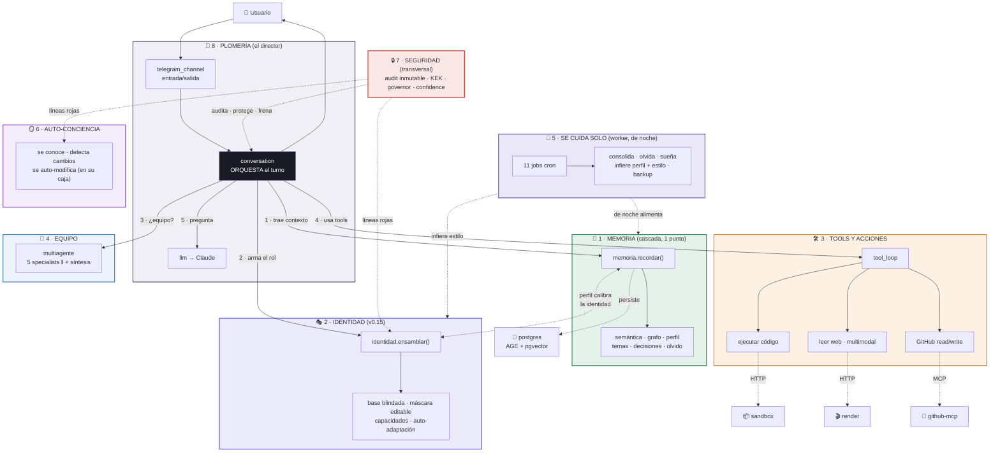
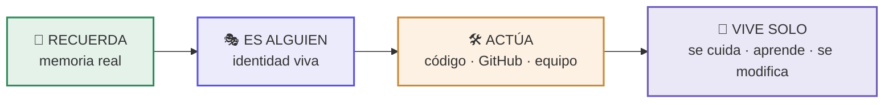

# 🧱 For3s OS en Bloques

**Status:** current · **Type:** fossil · **Updated:** 2026-07-30 · **Owner:** brian
**Migrated:** Doc/For3s_OS_En_Bloques.md → docs/analysis/For3s_OS_En_Bloques.md (2026-07-30, ADR-029)

> Mapa de For3s OS dividido en bloques (con mini-bloques dentro) + cómo se conectan entre sí a
> detalle. Base para explicar el sistema en la charla "Dale un trabajo a tu agente" (AI x Blockchain
> Day) y para onboarding. Fiel al código real (v0.15.0, 2026-07-04). 58 módulos → 8 bloques.

---

# PARTE 1 — LOS 8 BLOQUES

Si dividimos For3s OS, quedan **8 bloques grandes**, cada uno con mini-bloques dentro. Son los
"órganos" del agente.

## 🧠 BLOQUE 1 — MEMORIA (el más grande, con muchos mini-bloques)
*"Recuerda por significado, no solo los últimos mensajes"*

| Mini-bloque | Módulo(s) |
|---|---|
| Cerebro en cascada (1 punto de ensamblaje) | `memoria` |
| Búsqueda semántica | `memory` + `embeddings` (BGE-M3, 1024d) |
| Grafo de conocimiento | `kg` (Apache AGE) |
| Perfil del usuario (quién eres) | `perfil` + `perfil_infer` |
| Temas / hilos / estado | `temas` + `tema_estado` + `hilo_status` |
| Decisiones (el porqué) | `decisiones` |
| Olvido / relevancia | `relevance` + `consolidator` + `microglia` |

## 🎭 BLOQUE 2 — IDENTIDAD (lo nuevo, v0.15 "Identidad Viva")
*"Quién soy, y me adapto a ti"*

| Mini-bloque | Módulo(s) |
|---|---|
| Rol en capas + ensamblador único | `identidad` |
| Base blindada · máscara editable · auto-adaptación · Mente OS del usuario | (todo en `identidad`) |
| Cómo arma el prompt | `agent` |

## 🛠️ BLOQUE 3 — TOOLS Y ACCIONES (hacer trabajo real)
*"No solo hablo — actúo en el mundo"*

| Mini-bloque | Módulo(s) |
|---|---|
| El motor de herramientas | `tool_loop` |
| Ejecutar código | `execute` (+ contenedor `sandbox`) |
| GitHub (leer/escribir) | `mcp_client` + `gh_ficha` |
| Leer web | `web_fetch` (+ contenedor `render`) |
| Imágenes/PDF/Word/Excel | `multimodal` |
| Analizar repos grandes | `subbloques` |

## 🤝 BLOQUE 4 — EQUIPO (multi-agente + multi-usuario)
*"Para lo difícil, coordino un equipo"*

| Mini-bloque | Módulo(s) |
|---|---|
| 5 specialists en paralelo + síntesis | `multiagente` + `specialists` |
| Multi-usuario (roles, puerta /invitar) | `equipo` |
| Handoff auditable | `handoff` |

## 🌙 BLOQUE 5 — SE CUIDA SOLO (trabaja de noche)
*"Mientras no estás, me mantengo y me mejoro"*

| Mini-bloque | Módulo(s) |
|---|---|
| Los 11 jobs nocturnos (cron) | `tasks` |
| Sueña / se mejora (DMN) | `dmn` + `dmn_tasks` |
| Aprende skills | `aprende` + `skills` |
| Backup | `backup` |

## 🪞 BLOQUE 6 — AUTO-CONCIENCIA (se conoce y se modifica)
*"Sé cómo estoy hecho y me puedo editar"*

| Mini-bloque | Módulo(s) |
|---|---|
| Se conoce en vivo | `introspeccion` |
| Detecta qué cambió (propio vs externo) | `autodeteccion` |
| Edita su código/BD dentro de su caja | `automod` + `automod_bd` |

## 🔒 BLOQUE 7 — CONFIANZA Y SEGURIDAD (nivel enterprise)
*"Todo auditado, secretos cifrados, con frenos"*

| Mini-bloque | Módulo(s) |
|---|---|
| Auditoría inmutable (hash-chain) | `audit` |
| KEK / secretos cifrados | `secret_store` + `crypto` |
| Freno (gobierna auto-generación) | `governor` |
| Metacognición ("sé cuándo no sé") | `confidence` |
| Control de costo | `cost_control` + `modelos` |

## 🔌 BLOQUE 8 — PLOMERÍA (la base que lo sostiene)
*"El cableado interno"*

| Mini-bloque | Módulo(s) |
|---|---|
| Canal Telegram (entrada/salida) | `telegram_channel` |
| Orquesta el turno | `conversation` |
| Provider LLM (Claude) | `llm` |
| BD / caché | `db` + `cache` |
| Config / CLI | `config` + `cli` |
| Utilidades | `tiempo` · `text_normalize` · `md_html` · `analytics` · `health` · `version` · `concurrency` |

---

## 📊 Vista simple para la charla (4 bloques narrativos)
Para presentar es más fácil contar 4 que 8:

1. **🧠 RECUERDA** — Memoria (semántica + grafo + perfil)
2. **🎭 ES ALGUIEN** — Identidad viva (se adapta a ti)
3. **🛠️ ACTÚA** — Tools + Equipo (ejecuta código, GitHub, multi-agente)
4. **🌙 VIVE SOLO** — Se cuida, aprende, se conoce, se modifica — todo con confianza enterprise

> **En una línea:** *"Un bot solo responde. For3s recuerda, es alguien, actúa y vive solo — 8 bloques
> que lo hacen un agente de verdad."*

---
---

# PARTE 2 — CÓMO SE CONECTAN ENTRE ELLOS (a detalle)

Los bloques NO son islas. Hay un **director de orquesta** y flujos claros. Aquí está el cableado real.

## 🎯 El director de orquesta: BLOQUE 8 (conversation.py)
`conversation.py` es el **corazón que conecta todo**. Cada mensaje del usuario pasa por él, y él
coordina a los demás bloques en orden. No hay bloque que hable con otro "por su cuenta" en el turno
principal — todo pasa por el director. Esto se ve en sus imports reales: memoria, agent (identidad),
tool_loop, mcp_client, confidence, tema_estado, decisiones, kg, hilo_status.

## 🔄 FLUJO A — Un turno normal (llega un mensaje) — el flujo principal
Cuando escribes en Telegram, los bloques se activan EN ESTE ORDEN:

```
👤 Usuario escribe
   │
   ▼
[8·PLOMERÍA] telegram_channel recibe → autoriza → limpia el texto
   │
   ├──► [2·IDENTIDAD] detecta auto-adaptación ("sé más breve") → reescribe su capa 🎭
   │
   ▼
[8·PLOMERÍA] conversation.send() — EL DIRECTOR toma el control
   │
   ├─1─► [1·MEMORIA] memoria.recordar() → trae en cascada:
   │        semántica (memory+embeddings) → grafo (kg) → perfil → temas/estado/decisiones
   │        = el "CONTEXTO DE TU MEMORIA" que se inyecta
   │
   ├─2─► [2·IDENTIDAD] agent + identidad.ensamblar() → arma el ROL (base+máscara+capacidades)
   │
   ├─3─► ¿la tarea amerita EQUIPO? ──sí──► [4·EQUIPO] multiagente (5 specialists ‖) + síntesis
   │                                └─no─► sigue solo
   │
   ├─4─► [3·TOOLS] tool_loop → si hace falta:
   │        ejecutar código (execute→sandbox) · GitHub (mcp_client) · web (web_fetch→render)
   │
   ├─5─► [8·PLOMERÍA] llm → pregunta a Claude (con rol + memoria + tools)
   │
   ├─6─► [7·SEGURIDAD] confidence mide la confianza (metacognición) antes de afirmar
   │
   ▼
[8·PLOMERÍA] responde al usuario
   │
   ├──► [7·SEGURIDAD] audit registra la acción (inmutable)
   └──► [1·MEMORIA] memory.save() guarda el turno (→ luego se vectoriza y consolida de noche)
```

## 🌙 FLUJO B — De noche (nadie escribe) — el worker
El **worker** (mismos módulos, otro proceso) corre 11 jobs que conectan los bloques SIN el usuario:

```
⏰ cron dispara (madrugada México)
   │
   ├─01:00─► [5·SE CUIDA] job_backup → [7·SEGURIDAD] respalda la BD
   ├─02:00─► [5] job_cls → [1·MEMORIA] consolidator: episodios → conceptos del grafo (kg)
   ├─02:30─► [5] job_status → [1] hilo_status: resume hilos (para "¿en qué quedamos?")
   ├─02:45─► [5] job_relevance → [1] relevance: recalcula decay
   ├─03:00─► [5] job_microglia → [1] microglia: olvida el ruido viejo ya consolidado
   ├─03:30─► [5] job_curar_skills → [5] skills: archiva las que no se usan
   ├─03:45─► [5] job_perfil → [1·MEMORIA] perfil_infer: infiere tu perfil (propone, con gate)
   ├─03:50─► [5] job_estilo → [2·IDENTIDAD] identidad: infiere tu estilo y se acopla 🌙
   ├─04:00─► [5] job_dmn_noche → [5] dmn: sueña, evalúa, propone mejoras (gobernado)
   └─04:30─► [5] job_health_check → [7·SEGURIDAD] health: si algo 🔴, alerta al dueño
```
**Clave:** el bloque 5 (se-cuida) es el que MÁS conecta con otros de noche — alimenta la memoria
(1), ajusta la identidad (2) y vigila la seguridad (7). Por eso For3s "es mejor hoy que ayer".

## 🧠 Conexiones DENTRO del bloque MEMORIA (la cascada)
El bloque 1 no es plano — sus mini-bloques se llaman EN CASCADA desde 1 punto (`memoria.recordar()`):
```
memoria.recordar()  ← el único punto de ensamblaje
   ├─► línea de tiempo (lo último cronológico)
   ├─► hilo_status (retomar: "en qué quedamos")
   ├─► memory + embeddings (semántica: lo relevante por significado)
   ├─► kg (grafo: conceptos consolidados relacionados)
   ├─► perfil (quién eres → adapta la respuesta)
   └─► tema_estado + decisiones (estado del proyecto + porqués)
   = UN bloque de contexto unificado
```
Antes eran 5 silos sueltos; el rediseño los conectó en cascada (misma lección que la identidad).

## 🎭 Conexiones DENTRO del bloque IDENTIDAD (el ensamblador)
El bloque 2 también teje sus capas en 1 punto (`identidad.ensamblar()`):
```
identidad.ensamblar()  ← el único punto
   ├─► 🔴 base blindada (SOUL + ética + operativa)
   ├─► 🔵 capa usuario (IDENTITY.md + REGLAS_USUARIO.md, editables)
   ├─► ⚙️ capacidades (H1-H12 + infra viva)
   └─► 🔒 candado: la base SIEMPRE gana
   = FOR3S_ROLE (una sola voz)
```
Y se conecta con MEMORIA (2↔1): el perfil (bloque 1) informa cómo se expresa la identidad (bloque 2);
de noche job_estilo (bloque 5) ajusta la identidad observando la memoria de conversaciones.

## 🔒 El bloque SEGURIDAD (7) es transversal — toca a TODOS
No es un paso del flujo, es un **guardián que envuelve todo**:
- **audit** registra CADA acción de cualquier bloque (inmutable, hash-chain).
- **governor** frena al bloque 5 (auto-generación de skills) y al 6 (auto-modificación).
- **secret_store/crypto** protegen las llaves que usan el 3 (GitHub) y el 8 (LLM).
- **confidence** modera lo que el 8 (LLM) va a afirmar.
- **líneas rojas**: el bloque 2 (identidad) y el 6 (automod) NUNCA pueden tocar el 7.

## 🔌 Los contenedores hermanos (dónde viven los bloques)
Los bloques corren repartidos en 9 contenedores (hermanos de red, sin DinD):
- **agent** → bloques 1,2,3,4,6,7,8 (el cerebro) · **worker** → bloque 5 (jobs, misma imagen)
- **postgres** (AGE+pgvector) → donde persiste el bloque 1 · **valkey** → caché/cola
- **sandbox** → donde el bloque 3 ejecuta código · **render** → donde el bloque 3 lee web
- **github-mcp** (read) + **github-mcp-write** → donde el bloque 3 habla con GitHub
- **grafana** → lee del bloque 1 para dashboards

## 🕸️ Resumen de las conexiones clave (quién habla con quién)
| Conexión | Qué pasa |
|---|---|
| **8 → todos** | conversation orquesta el turno (el director) |
| **1 ↔ 2** | el perfil (memoria) calibra la identidad; el estilo ajusta la identidad de noche |
| **8 → 3** | el tool-loop invoca ejecutar código / GitHub / web cuando hace falta |
| **8 → 4** | si la tarea amerita, se lanza el equipo multi-agente |
| **5 → 1** | de noche alimenta la memoria (consolida, olvida, infiere perfil) |
| **5 → 2** | de noche ajusta la identidad (infiere estilo) |
| **7 → todos** | audita, protege secretos, frena, mide confianza (transversal) |
| **6 → 6** | la auto-modificación se prueba en aislado antes de aplicarse (guardián rescata) |

---

**La idea de fondo:** For3s no es 58 piezas sueltas — es 8 bloques con un director (conversation) que
los coordina en el turno, un worker que los mantiene de noche, y un guardián de seguridad que los
envuelve. Los dos bloques más "vivos" (memoria e identidad) comparten el mismo patrón: muchos
mini-bloques que se tejen en UN punto de ensamblaje. Eso es lo que lo hace un agente, no un bot.

Relacionado: `.codeviz/For3s/For3s_Completo_2026-07-04.md` (diagrama) · [[project_hito_identidad_viva]] ·
[[project_rediseno_memoria_cerebro]] · `Cerebro/For3s_OS_Grafo_Maestro.md` (arquitectura maestra).

---
---

# PARTE 3 — DIAGRAMA VISUAL (los 8 bloques + cómo se conectan)



## Cómo leer el diagrama
- **Flechas sólidas con número (1-5)** = el orden del flujo de un turno (el director `conversation` los coordina).
- **Flechas punteadas** = conexiones de fondo entre bloques (memoria↔identidad, el worker que alimenta de noche, seguridad transversal, y los contenedores hermanos donde corren las acciones).
- **`conversation` (negro)** = el director de orquesta: todo pasa por él.
- **Bloque 7 (rojo)** = envuelve a todos (no es un paso, es un guardián).
- **Bloque 5 (worker)** = el único que trabaja SIN el usuario, de noche, alimentando 1, 2 y 7.

## Versión ULTRA-simple (4 bloques, para una slide de apertura)

