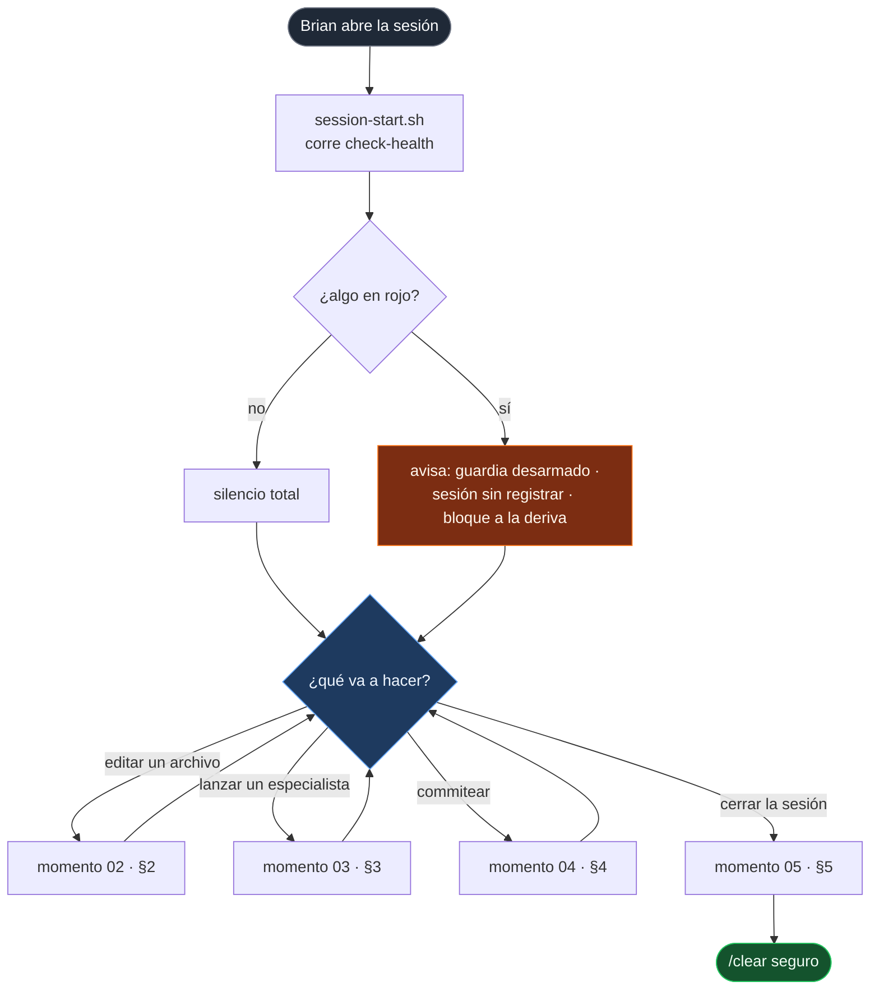
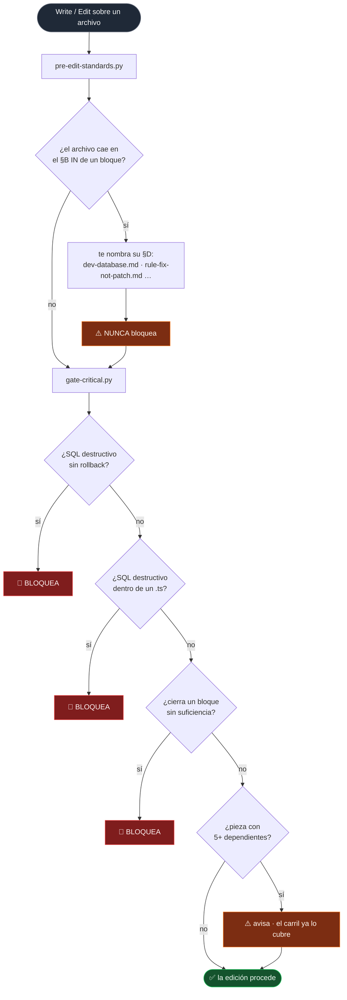
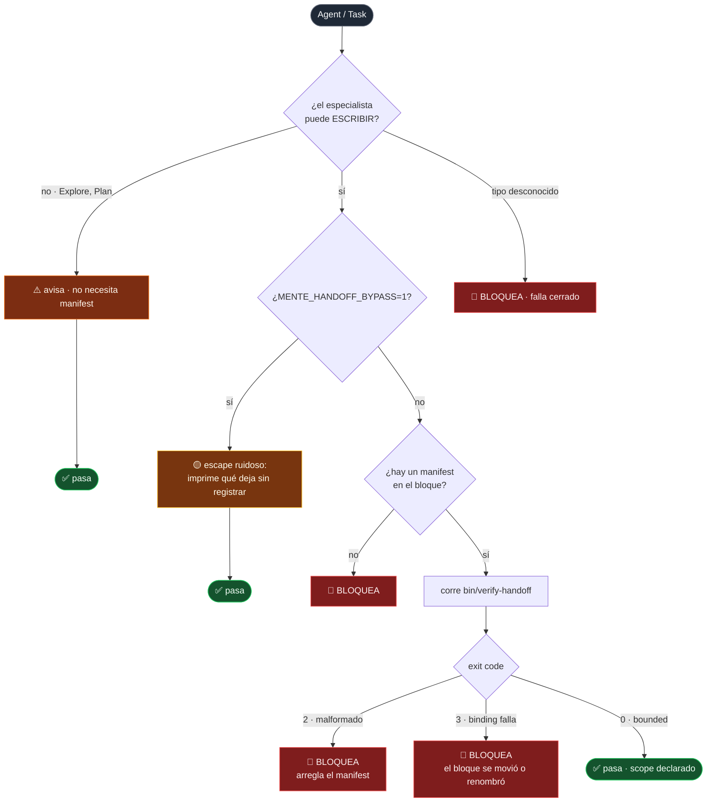
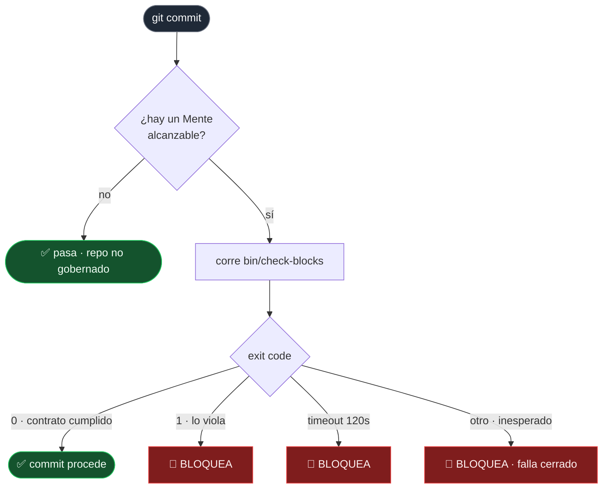
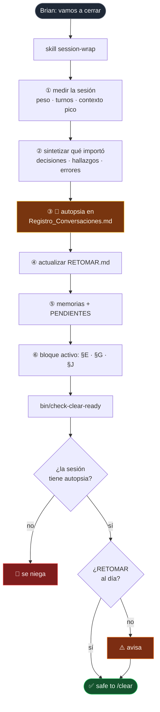
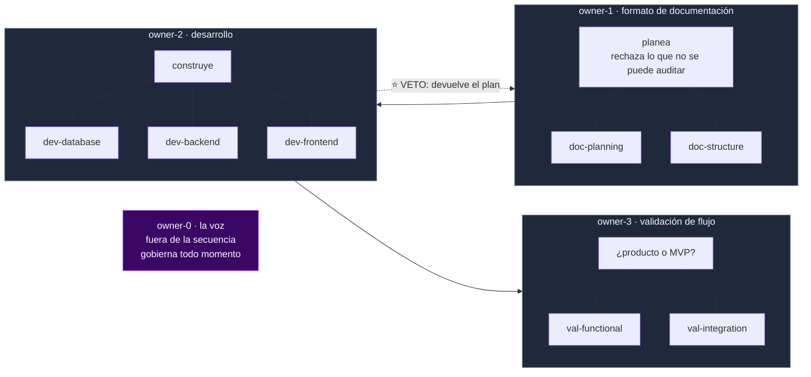
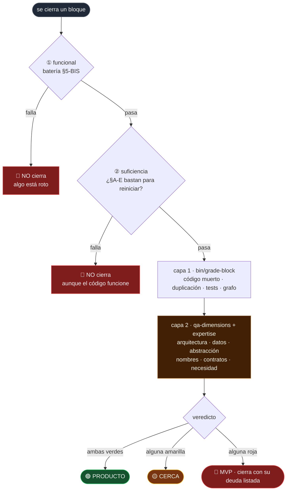

# 🚦 CÓMO FUNCIONA MENTE OS v2 — el flujo completo
**Status:** current · **Type:** architecture · **Updated:** 2026-07-31 · **Owner:** brian
**Purpose:** qué se dispara, cuándo, y qué pasa en cada rama. El mapa operativo.
**Medido en disco el 2026-07-31** — ninguna cifra de este documento viene de memoria.
---

> **La ley que decide qué va a script y qué queda escrito:**
> *una regla en código se cumple 100%; una regla que solo vive en un documento se cumple 40-60%.*
> Medida el 2026-07-27. Por eso **la doctrina es documento y la VERIFICACIÓN es script.**

Mente OS v2 no es una carpeta de documentos: son **4 hooks y 13 validadores** que corren en
momentos concretos.

---

## 1 · EL FLUJO COMPLETO DE UNA SESIÓN

**El hook de arranque está diseñado para callar.** Un guardia que avisa en cada sesión se ignora
en una semana, y un guardia ignorado no protege nada.

---

## 2 · MOMENTO 02 — vas a editar un archivo

**Disparo:** `PreToolUse(Write|Edit)` → dos hooks en cadena.

**Por qué el primero nunca bloquea:** actúa por coincidencia de ruta. Bloquear con esa señal haría
insufrible editar, y una puerta insufrible se apaga.

**Por qué el último solo avisa:** se midió que son 5 archivos editados a diario y el carril de
propagación ya fuerza la evaluación. Una segunda parada no añade nada.

---

## 3 · MOMENTO 03 — vas a lanzar un especialista

**Disparo:** `PreToolUse(Agent|Task)` → `gate-handoff.py`

**El nivel se midió, no se eligió.** Sobre todo el historial del proyecto:

| Herramienta | Llamadas |
|---|---|
| Bash | **9,786** |
| Edit | 3,289 |
| Read | 1,851 |
| **Agent** | **32** — 15 de ellas de solo lectura |

Esa medición **invirtió el diagnóstico**: el fallo del 20-jul no fue *delegar mal* — fue **no
delegar**, y meter 421 comandos en un solo contexto hasta llegar a 999K y provocar el incidente
del 21-jul. Bloquear también al lector barato empujaría de vuelta a ese comportamiento.

> ⭐ **Presencia no es cumplimiento.** Un manifest en disco no abre nada: la puerta corre
> `verify-handoff` y exige **exit 0**. Un manifest sin llenar deja la puerta cerrada.

---

## 4 · MOMENTO 04 — vas a commitear

**Disparo:** `.git/hooks/pre-commit` → `hooks/pre-commit.sh`

**La rama que importa es la última:** una salida inexplicada **no es un aprobado**. Si el validador
no puede correr, el commit no pasa.

---

## 5 · MOMENTO 05 — vas a cerrar la sesión

Dos mitades, y hacen falta las dos: `check-clear-ready` **se niega** (determinista), la skill
`session-wrap` **decide qué importó** (juicio, que ningún script puede).

**Por qué existe:** el peor fallo del proyecto. *"Todo está perfecto"* antes de un `/clear`,
*"sigue roto"* después. Mismo código, veredictos opuestos, minutos de diferencia.

Nada mintió: **`/clear` es un CORTE, no un guardado.** El primer veredicto vivía solo en la
conversación y murió con ella. El arreglo no es mejor memoria — es **negarse a cortar mientras el
veredicto viva solo en el contexto.**

---

## 6 · QUIÉN JUZGA QUÉ — el árbol de encargados

Tres encargados **en secuencia**. Cada uno tiene sus disciplinas (sus raíces), y **ninguno inventa
criterio**: lo carga.

> **Brian, 2026-07-31, corrigiendo a la IA:** *"los expertise eran formato de documentación,
> desarrollador, validación de flujo funcional. Los 3 que pusiste van DENTRO de desarrollador —
> es una división como si fuera un árbol."*

**Por qué importa la distinción:** los encargados son la **secuencia** (quién actúa, en qué orden,
con qué veto). Las disciplinas son la **materia**. Al aplanarlos parecía que `dev-database` podía
devolverle un plan a owner-1 — no puede; ese veto es solo de owner-2.

---

## 7 · EL VEREDICTO DE CALIDAD — dos capas

| Capa | Qué juzga | Quién la escribe | Estado |
|---|---|---|---|
| **1 · medible** | código muerto · duplicación · tests · grafo | ya es código (`bin/grade-block`) | ✅ **funciona hoy** |
| **2 · criterio** | las 6 dimensiones con evidencia exigida | **solo Brian** | ⬜ **66 huecos** |

> ⭐ Un 🔴 **no prohíbe cerrar el bloque.** Prohíbe cerrarlo **como producto**: cierra marcado MVP,
> con su deuda listada.

**Una dimensión no se contesta afirmándola** — se contesta mostrando la evidencia. Eso es lo que
impide que la IA se autoapruebe.

---

## 8 · QUÉ FUNCIONA Y QUÉ NO — medido 2026-07-31

### ✅ Funciona, verificado

- **`test-f0-f6` = 113/113**, cero fallas, en tres corridas seguidas.
- **Las 4 puertas operan.** Probado en vivo: lanzar un `general-purpose` quedó bloqueado; un
  `Explore` pasó y devolvió su respuesta.
- **El cableado del expertise funciona.** Editar `userStore.ts` nombra `dev-database.md` antes de
  la edición, sin que nadie lo pida.
- **Los tres fallos del diagnóstico se cerraron:** 0 → 221 documentos con metadata · índice de
  35 → 286 archivos · 5 de 11 sesiones sin registrar → **11 de 11**.

### 🟡 No funciona todavía

- **El tubo pasa vacío.** Los 7 archivos de expertise tienen estructura y cableado, pero su
  criterio son **66 huecos ⬜**. Hoy el sistema responde *"¿cumple las métricas?"*; todavía no
  *"¿lo haría un senior?"* — que era el diferenciador del v2.
- **Nunca ha gobernado trabajo real.** Los commits desde que nació el v2 son el v2 construyéndose,
  migrándose y probándose **a sí mismo**. Cero sesiones de producto. El propio bloque `demo` lo
  registra en su §E: *"untouched on 2026-07-31 — that session built Mente OS v2, not the demo"*.

> La ley que justifica el sistema se midió sobre trabajo de producto. Sobre trabajo de producto,
> el v2 lleva **0 sesiones de evidencia**.

---

## 9 · RESUMEN — solo 3 acciones bloquean

De todo el sistema, únicamente estas detienen el trabajo:

| # | Acción | Puerta |
|---|---|---|
| 1 | destruir datos sin vuelta atrás | `gate-critical` |
| 2 | cerrar un bloque que no se puede reiniciar desde disco | `gate-critical` + `check-sufficiency` |
| 3 | lanzar un especialista que escribe, sin scope declarado | `gate-handoff` |

Más dos negativas fuera del flujo de edición: `pre-commit` (un bloque que viola su contrato) y
`check-clear-ready` (cortar con algo sin guardar).

**Todo lo demás informa.** Esa proporción es deliberada: el sistema se gana el derecho a bloquear
demostrando primero que el criterio funciona.

---

Relacionado: `docs/architecture/` (el diseño completo) · `principles/owner-*.md` (los encargados) ·
`principles/expertise/` (las disciplinas) · `rules/qa-dimensions.md` (las 6 dimensiones) ·
`docs/PENDING-BRIAN.md` (los 66 huecos) · `rules/contract-handoff.md` (la puerta de delegación).
